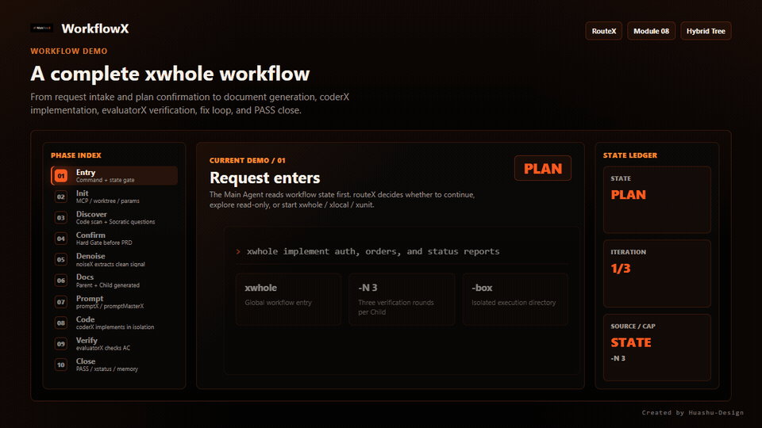

<div align="center">

[中文](./README.md) · **English**

# WorkflowX

### Make AI coding as controllable as a real team

<p align="center">
  
</p>

**A pure file-driven multi-agent framework — turning "chatting with AI to write code" into a planned, verified, traceable engineering process**

[](./LICENSE)
[](#deep-dive)
[](#deep-dive)
[](#deep-dive)


</div>

---

## What is it?

**WorkflowX is a workflow framework that lives inside your AI coding tool.** It turns a single AI's freestyle "chat-and-code" into a role-based pipeline: **an orchestrator plans, dispatches, and keeps records; a coder agent writes the code; an evaluator agent independently verifies it** — failing work gets sent back to redo, only passing work ships.

No servers, no runtime to set up. Copy the config files into your project and it runs directly inside **Claude Code / OpenAI Codex / OpenCode**.

<p align="center">
  
  <br/>
  <sub>A full xwhole workflow: contain the request → Hybrid Tree → optimized prompt → code → independent verification → fix loop → PASS close</sub>
</p>

---

## Why do you need it?

Chatting with a single AI to write code, you've probably hit these traps. WorkflowX gives each one a built-in answer:

| Pain point of AI coding | How WorkflowX solves it |
|---|---|
| **Long chats lose control of context**, becoming noisy and expensive | Each agent works in an **isolated context**, communicating only through structured Payloads |
| **AI claims "done" but did not actually meet the requirement** | The evaluator verifies independently and checks every acceptance criterion before passing |
| **Requirements are scattered across chat history** | Requirements become a structured **Hybrid Tree**: traceable, incrementally editable, and change-aware |
| **Misread requirements are discovered after coding** | Socratic questioning and proactive challenge surface assumptions, boundaries, and risks during planning |
| **Multi-round iteration burns tokens quickly** | Three-layer token optimization saves 40–60% in multi-round workflows |
| **Parallel tasks overwrite each other or conflict** | Each agent works in an isolated git worktree, with cross-branch violation detection |

---

## Understand it in 30 seconds

The whole framework is one core loop. You talk to a single role; it coordinates the rest for you:

```
       you ──request──▶  orchestratorX (the sole document writer)
                              │
                  ① writes the requirement into a Hybrid Tree (structured spec)
                              │
                  ②  ┌───────────────────────────────┐
                     ▼                               │ failed — send back with fix instructions
              coderX codes  ──Change Summary──▶  evaluatorX verifies independently
                                                     │
                  ③  passed ───────────────────────┘ → close as final version
```

- **orchestratorX — the orchestrator**: the only role you talk to. It plans requirements, decomposes tasks, dispatches agents, and tracks state. It is the only writer of the requirement docs, so state stays consistent.
- **coderX — the coder**: reads the spec, writes code, then outputs a structured Change Summary.
- **evaluatorX — the evaluator**: independently reads the code and checks it against the acceptance criteria (AC). Fails emit fix instructions and go back to coderX; passes close.
- **Hybrid Tree — the requirement doc tree**: a `Parent` (overview/routing) plus multiple `Child` docs (subtasks with their own AC). This is the single source of truth; requirement changes only touch it.

> In one line: **orchestrator plans, coder implements, evaluator gatekeeps, the doc tree keeps the books.** Each code→verify round auto-repeats on failure (default max 2), and closes on pass.

<p align="center">
  
  <br/>
  <sub>Orchestration + Data Layer: orchestratorX dispatches sub-agents, collaborating via Hybrid Tree + MCP Memory Graph</sub>
</p>

---

## Quick Start

**Requirements**: Node.js v18+

**① Install MCP dependencies** (for cross-session memory)

```bash
npm install -g @modelcontextprotocol/server-memory @modelcontextprotocol/server-sequential-thinking
```

**② Install WorkflowX**

| Platform | How to install |
|----------|----------------|
| **Claude Code** | `/plugin marketplace add https://github.com/TreeX-X/workflowX` → `/plugin install workflowx` |
| **OpenAI Codex** | `/plugins` → search `workflowx` → Install Plugin |
| **OpenCode** | Add `"plugin": ["workflowx@git+https://github.com/TreeX-X/workflowX.git"]` to `opencode.json` |
| **Manual** | Copy the `.claude/` (or `.codex/` / `.opencode/`) dir into your project root, then mount MCP config per `mcp.json.template` |

**③ Run your first command**

```bash
xwhole implement user login with email+password and OAuth support
```

> The orchestrator will ask you a few key questions, propose options, and — once you confirm — automatically enter the "code → verify → iterate" loop. See the full [walkthrough](#a-complete-workflow) below.

---

## Four modes: which one?

Pick by scope of change, largest to smallest. **Not sure? Just state the requirement** — the framework analyzes it and recommends a mode for you to confirm.

| Mode | One-line use case | Planning | Verify loop | Trigger example |
|------|-------------------|----------|-------------|-----------------|
| **`xwhole`** Global | New features, cross-module refactors | Multi-turn → Hybrid Tree | Auto, up to N rounds | `xwhole build the order center` |
| **`xwhole -parallel`** Parallel | Multiple independent subtasks at once<br/>*(Claude Code only)* | Same as xwhole, auto-split | Parallel evaluators | `/xwhole -parallel build user, order, product modules` |
| **`xlocal`** Scoped | Changes/bug fixes within 1–2 modules | Skipped (auto-detect/generate PRD) | Auto, up to N rounds | `xlocal fix order list pagination bug` |
| **`xunit`** Minimal | Single file, small change | Skipped | Off by default | `xunit add timeout config to Config` |

**Common flags**: `-N 3` cap iterations at 3 (default 2) ｜ `-box demo` isolate in a sandbox branch (xwhole only)

**Other commands**:

| Command | Purpose |
|---------|---------|
| `xstatus` | Generate a high-fidelity HTML workflow status report |
| `xprompt [text]` | Optimize a prompt only, no dev workflow triggered |

> **Trigger syntax differs**: Claude Code & OpenCode use slash commands (`/xwhole`); **OpenAI Codex uses a natural-language prefix** (start your message with `xwhole`, no slash). The `-parallel` mode is **Claude Code only**.

---

## A complete workflow

Take `xwhole implement user login`. You'll go through these 6 steps:

```
①  You initiate the request
    xwhole implement user login with email+password and OAuth support

②  Orchestrator plans (Phase 1: Discovery)
    → Socratic questions: how is the OAuth token refreshed? limit concurrent logins?
    → Autonomously explores the codebase, proposes 2-3 options with trade-offs
    → You review and reply "confirmed" → Hybrid Tree generated

③  Instruction optimization (promptMasterX)
    → Detects anti-patterns, produces a precise, unambiguous execution instruction

④  coderX implements
    → Builds the feature, outputs a Change Summary

⑤  evaluatorX verifies independently
    → Checks every acceptance criterion, outputs AC status table + issue list
    → Failed → sends back to ④ with fix instructions for another round

⑥  Close
    → Evaluator confirms PASS, Hybrid Tree finalized
```

Throughout, you only do two things: **answer the orchestrator's clarifying questions**, and **confirm the plan at key checkpoints**. All coordination, dispatch, verification, and bookkeeping happen automatically.

---

## Deep Dive

> The above is enough to get started. If you want to know *why* it's cheaper, more accurate, and more controllable, expand below.

<details>
<summary><b>Hybrid Tree — the structured requirement doc tree</b></summary>

<br/>

All planning output becomes a Hybrid Tree instead of being scattered across chat:

- **Parent (overview layer)**: global spec, NFRs, DoD, routing table, global file index, knowledge-graph outline.
- **Child (requirement layer)**: one per submodule, holding that branch's **acceptance criteria (AC)** and private file index.
- **MECE division**: Children are mutually exclusive and collectively exhaustive — no gaps, no overlaps; every task has a clear owner and AC.
- **Auto dependency queue**: cross-Child dependencies live in the Parent; the core loop's Ready Queue schedules by dependency order, deferring tasks whose deps aren't met.
- **Traceable changes**: changing a requirement only edits the relevant Section; affected Children are auto-marked "needs re-evaluation" and re-enter the loop.

</details>

<details>
<summary><b>AC cross-validation — the evaluator doesn't trust the coder</b></summary>

<br/>

evaluatorX is an **independent** quality gate. It never accepts coderX's self-report, instead it:

1. independently reads the actual code;
2. checks it line by line against the Child's acceptance criteria (AC);
3. outputs a structured report: an **AC status table** (pass / partial / fail / unevaluable) + a **P0/P1/P2 issue list** + **fix instructions**.

Only when all ACs pass does it ship; otherwise fix instructions flow back to coderX for the next round (default max 2, tunable via `-N`). Paired with **independent iteration counters + early-exit**, it avoids wasted spend.

</details>

<details>
<summary><b>Three-layer token optimization — 40–60% savings on iterations</b></summary>

<br/>

<p align="center">
  
</p>

| Layer | Strategy | Effect |
|---|------|------|
| **L1 Section Caching** | Strict zoning: rarely-changing static sections (requirements/scope/DoD) pinned at top to hit the LLM prompt cache; dynamic sections (eval reports) at the bottom, overwritten without invalidating the cache | 40–60% after round 1 |
| **L2 Trunk-Leaf** | Markdown keeps only the business "trunk" outline; entity relations ("leaves") are maintained separately in the MCP knowledge graph and retrieved on demand | Lean docs |
| **L3 Memory Snapshot** | The Hybrid Tree stores only skeleton pointers (entity names, relation summaries); full nodes persist in MCP server-memory | Cross-session · minimal context |

</details>

<details>
<summary><b>Socratic requirements discovery — surface problems during planning</b></summary>

<br/>

xwhole's Phase 1 doesn't rush to code — it pins down the requirement first:

- **Requirement clarification (via socratesX)**: Phase 1 drives Socratic questioning through the socratesX skill — one core question per turn with options + a recommendation, exploring the codebase before asking and assessing clarity qualitatively before proceeding.
- **One question per turn, explore before asking**: each question builds on the last answer, and it always searches the codebase first — advancing with "here's what I found X" rather than "can you tell me X".
- **Proactive challenge**: even when the requirement looks clear, it's forced to analyze 6 risk categories — contradictions, edge cases, technical risks, hidden assumptions, cross-module conflicts, missing NFRs.

</details>

<details>
<summary><b>Smart routing — every request passes a status gate</b></summary>

<br/>

WorkflowX has a four-layer router. Every input reads `.hybrid/status.json` first, then dispatches:

| Route | Trigger | Handling |
|------|----------|----------|
| **Route 0** | Active workflow (status=xwhole/xlocal/xunit) | Input treated as part of the current workflow; supports incremental requirement changes |
| **Route 1** | Exploratory/read-only (view/analyze/search/git/config) | Handle directly — no sub-agent dispatch, no code changes |
| **Route 2** | Coding intent + status=wait | 5-dimension analysis → recommend mode → **must confirm via dialog** → start |
| **Route 3** | Explicit command (`/x*` or `x*`) | Execute immediately, override existing workflow, no confirmation |

**State machine**: `wait` (idle) ｜ `normal` (Route 1 running) ｜ `xwhole`/`xlocal`/`xunit` (that workflow active). State is written solely by the Main Agent to `.hybrid/status.json`, so **a session auto-resumes after interruption**.

</details>

<details>
<summary><b>Other built-in capabilities</b></summary>

<br/>

- **promptMasterX (prompt optimization engine)**: the built-in `prompt-master` skill generates production-grade prompts for 20+ AI tools, including 9-dimension intent extraction, tool-specific routing, 6-category fault scanning, and copy-paste-ready output.
- **razorX (code aesthetics framework)**: guided by "Can the path be shorter? Can cognitive load be lower?" Review mode scans line by line; Generation mode is declarative-first.
- **xstatus (status visualization)**: one command generates a high-fidelity HTML workflow status report built on the `huashu-design` language.
  ```bash
  xstatus                                 # output to ./status-report.html and open
  xstatus --output ./reports/today.html   # output to a custom path
  ```

</details>

---

## Platform Support

All three configs share **identical** workflow logic — only trigger syntax and parallel capability differ. All modes auto-enable Worktree isolation (except xunit).

| Platform | Config dir | Trigger style | Parallel |
|------|----------|----------|----------|
| **Claude Code** | `.claude/` | Slash commands `/xwhole` `/xlocal` `/xunit` `/xstatus` `/xprompt` | Supports `/xwhole -parallel` (Agent Teams) |
| **OpenAI Codex** | `.codex/` | **Natural-language prefix** `xwhole` `xlocal` … (no slash) | Not supported |
| **OpenCode** | `.opencode/` | Slash commands `/xwhole` `/xlocal` … | Not supported |

---

## Framework Comparison

> Full analysis (architecture, token consumption, AI pain points, detailed scoring) in [comparison-report.md](docs/comparison-report.md).

<table>
<tr>
<td width="50%">

**WorkflowX's 6 unique capabilities**
- Hybrid Tree requirement tracking
- AC cross-validation
- Prompt optimization engine
- Cross-branch violation detection
- Weighted Socratic discovery
- Code aesthetics framework

</td>
<td width="50%">

**Weighted total (out of 100)**

| Framework | Score |
|------|:---:|
| **WorkflowX** | **83** |
| Superpowers | 80 |
| OMC | 73 |

</td>
</tr>
</table>

<details>
<summary>Expand detailed scoring & capability comparison</summary>

<br/>

| Category (Weight) | WorkflowX | Superpowers | OMC |
|-------------------|:---------:|:-----------:|:---:|
| Architecture & Design (25%) | **9.15** | 6.70 | 7.40 |
| Workflow & Process (30%) | **9.20** | 7.60 | 7.50 |
| Quality & Reliability (25%) | 7.85 | **8.55** | 7.70 |
| Platform & Ecosystem (20%) | 6.40 | **9.60** | 6.60 |
| **Weighted Total** | **83** | **80** | **73** |

| Capability | WorkflowX | Superpowers | OMC |
|------------|:---------:|:-----------:|:---:|
| Hybrid Tree PRD tracking | Unique | Not supported | Not supported |
| AC cross-validation | Unique | Not supported | Not supported |
| Prompt optimization engine | Unique | Not supported | Not supported |
| Cross-branch violation detection | Unique | Not supported | Not supported |
| Socratic requirements discovery | Weighted + proactive | Basic | Basic |
| Code aesthetics framework | Unique | Not supported | Not supported |
| Token incremental optimization | Systematic | Partial | Partial |
| TDD iron rule | Not supported | Strictest | Partial |
| Systematic debugging | Not supported | 4-phase | Partial |
| Smart model routing | Not supported | Not supported | Supported |
| Multi-AI cross-validation | Not supported | Not supported | Supported |
| Security review (OWASP) | Partial | Not supported | Professional |
| Multi-platform native | 4 platforms | 8 platforms | 2 platforms |

<p align="center">
  
</p>

</details>

---

## About

An open-source experimental project deployed across real communities, exploring best practices and architecture for multi-agent collaborative development.

Discussions, suggestions, and contributions of any kind are welcome! Fork the repo and open a Pull Request, or share ideas in Issues.

If this helps you, a star helps more people discover and test the workflow.

**Friend link**: [Linux.Do](https://linux.do/) — a community providing high-quality discussions and resource sharing for tech enthusiasts and professionals.

---

<div align="center">

[MIT License](./LICENSE) · Free to use / Modify / Redistribute　·　Made by [@TreeX-X](https://github.com/TreeX-X)

</div>

## Star History

<a href="https://www.star-history.com/#TreeX-X/workflowX&Date">
 <picture>
   <source media="(prefers-color-scheme: dark)" srcset="https://api.star-history.com/chart?repos=TreeX-X/workflowX&type=date&theme=dark&legend=top-left" />
   <source media="(prefers-color-scheme: light)" srcset="https://api.star-history.com/chart?repos=TreeX-X/workflowX&type=date&theme=light&legend=top-left" />
   
 </picture>
</a>
