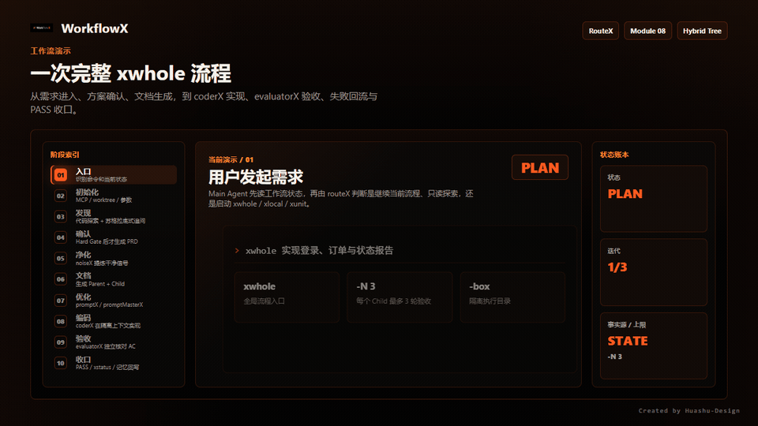
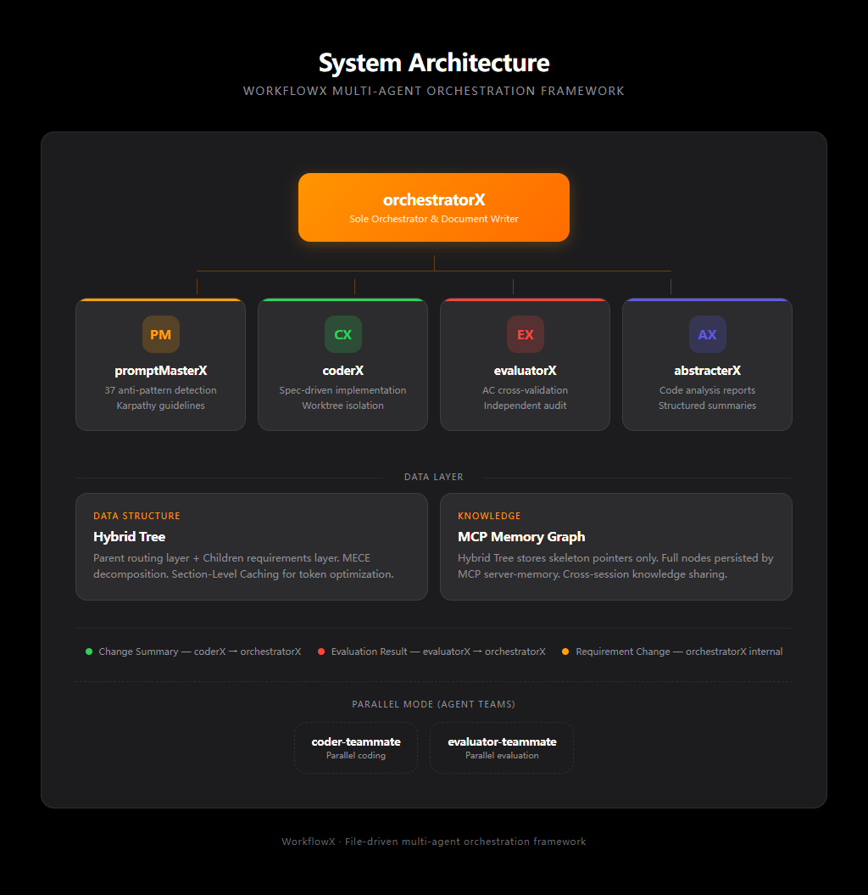
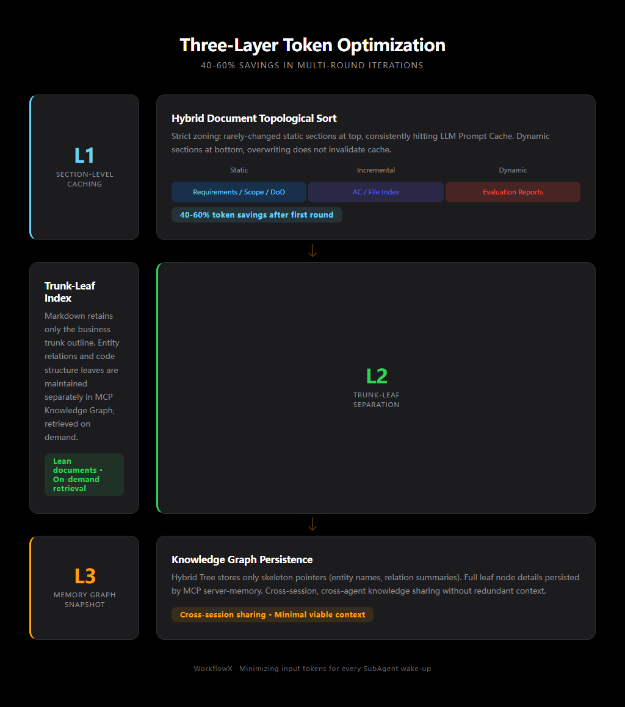
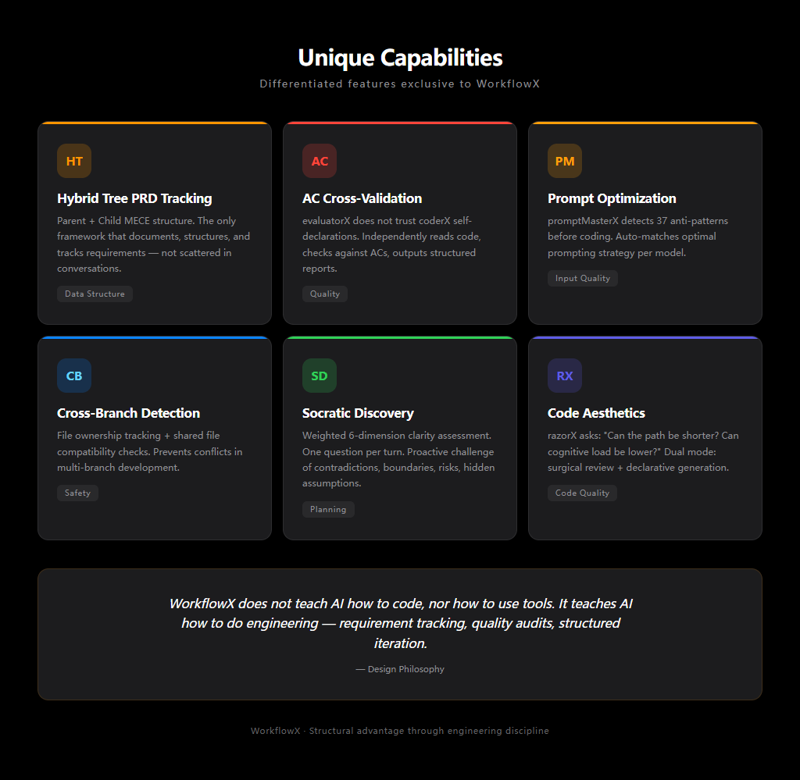

<div align="center">

[中文](./README.md) · **English**

# WorkflowX

### Hybrid-Doc-Driven Multi-Agent Collaboration Framework


**File-driven · Zero Dependencies · Structured Requirements · AC Cross-Validation · Token-Optimized**

[](./LICENSE)
[](#-core-capabilities)
[](#-core-capabilities)
[](#-core-capabilities)


</div>

---

## Workflow Demo

<p align="center">
  
  <br/>
  <sub>xwhole mode full workflow: Requirements → promptMasterX → coderX → evaluatorX → Iteration Complete</sub>
</p>

---

## Design Philosophy

> **Independent context for maximum efficiency. Hybrid document-driven state for seamless human-in-the-loop interaction. A single document writer ensures state consistency; structured Payload communication achieves zero context pollution.**

<table>
<tr>
<td width="50%">

**Single Writer, Consistent State**
orchestratorX is the sole document writer — no multi-source conflicts. All sub-agents (coderX, evaluatorX) are read-only + Payload output only.

</td>
<td width="50%">

**Zero-Dependency, Config-and-Run**
Pure Markdown-driven. No servers to install, no runtime to set up. Copy config files into your project and deploy.

</td>
</tr>
<tr>
<td>

**Reduce Hallucinations, Maximize Efficiency**
Pristine context + structured Payload communication + Worktree physical isolation. Every SubAgent wake-up gets the minimum viable input tokens.

</td>
<td>

**Single-Point Operations, Global Sync**
Requirement changes propagate automatically. Dependencies auto-retry via deferred queue. Hybrid Tree's MECE structure ensures every task has clear ownership and acceptance criteria.

</td>
</tr>
</table>

---

## System Architecture

**orchestratorX** is the sole document writer, dispatching sub-agents via Bus Payload:

- **Bus Payload Communication** — 3 structured Payload types (Change Summary / Evaluation Result / Requirement Change), zero context pollution
- **Hybrid Tree** — Parent routing layer + Children requirement layer, MECE division, Section-Level Caching
- **Worktree Isolation** — Each sub-agent works in an independent git worktree, physical isolation
- **AC Cross-Validation** — evaluatorX doesn't trust coderX's declarations, independently verifies every acceptance criterion

<p align="center">
  
  <br/>
  <sub>Orchestration + Data Layer: orchestratorX dispatches 4 sub-agents via Hybrid Tree + MCP Memory Graph</sub>
</p>

---

## Core Capabilities

### Socratic Requirements Discovery (Module 08)

> Surface hidden assumptions and edge cases during planning, not after coding.

- **Weighted Clarity Assessment**: 6 dimensions (Target User 15% / Functional Scope 25% / Technical Constraints 20% / Boundary Conditions 15% / AC 15% / NFR 10%)
- **One question per turn, prefer multiple choice**: Each question builds on the previous answer, going deeper
- **Proactive Challenge**: Even with clear requirements — analyzes contradictions, edge cases, risks, hidden assumptions, cross-module conflicts, missing NFRs

### Prompt Optimization Engine (promptMasterX)

Built-in **prompt-master** skill generates production-grade prompts for 20+ AI tools:

- **9-Dimension Intent Extraction**: Silently analyzes task, target tool, output format, constraints
- **Tool-Specific Routing**: Auto-matches optimal prompting strategies per model
- **6-Category Fault Scanning**: Detects and fixes ambiguity, missing context, format drift
- **Copy-Paste Ready**: Outputs a single prompt block requiring zero manual edits

### Three-Layer Token Optimization

> 40-60% token savings in multi-round iterations. Every SubAgent wake-up gets the minimum viable input.

<p align="center">
  
  <br/>
  <sub>L1 Section-Level Caching + L2 Trunk-Leaf Separation + L3 Memory Graph: 40-60% savings in multi-round iterations</sub>
</p>

| Layer | Strategy | Effect |
|-------|----------|--------|
| **L1: Section-Level Caching** | Strict zoning: rarely-changing static sections (requirements/scope/DoD) pinned at top for LLM Prompt Cache; dynamic sections (evaluation reports) at bottom don't invalidate cache | 40-60% savings after first round |
| **L2: Trunk-Leaf Index** | Markdown retains only the business outline; entity relations maintained separately in MCP Knowledge Graph, retrieved on demand | Lean documents, on-demand retrieval |
| **L3: Memory Graph Snapshot** | Hybrid Tree stores skeleton pointers only (entity names, relation summaries); full nodes persisted by MCP server-memory | Cross-session sharing, minimum viable context |

### AC Cross-Validation

**evaluatorX doesn't trust coderX's self-declarations** — it independently reads code, checks against acceptance criteria, and outputs a structured evaluation report (AC status table: pass / partial / fail / unevaluable + P0/P1/P2 issue list + fix instructions).

### Code Aesthetics Framework (razorX)

> "Can the path be shorter? Can cognitive load be lower?"

Dual-mode operation:
- **Review mode**: Line-by-line surgical scan
- **Generation mode**: Declarative, stdlib-first, composable functions

### Workflow Status Visualization (`/xstatus`)

A single command generates a high-fidelity HTML status report, built on `huashu-design` language — warm off-white background + serif display font + rust orange accent. Anti-AI-slop design.

```bash
/xstatus                            # Output to ./status-report.html and open
/xstatus --output ./reports/today.html  # Output to a custom path
```

---

## Quick Start

### Requirements

- Node.js v18+
- MCP tools: `npm install -g @modelcontextprotocol/server-memory @modelcontextprotocol/server-sequential-thinking`

### Installation

**Option 1: Plugin Marketplace (Recommended)**

| Platform | Install Command |
|----------|----------------|
| **Claude Code** | `/plugin marketplace add https://github.com/TreeX-X/workflowX` → `/plugin install workflowx` |
| **OpenAI Codex** | `/plugins` → search `workflowx` → Install Plugin |
| **GitHub Copilot** | `copilot plugin marketplace add https://github.com/TreeX-X/workflowX` → `copilot plugin install workflowx@workflowx` |
| **OpenCode** | Add `"plugin": ["workflowx@git+https://github.com/TreeX-X/workflowX.git"]` to `opencode.json` |

**Option 2: Manual Setup**

```bash
# 1. Copy config directory to project root
cp -r .claude/ /your/project/

# 2. Install MCP dependencies
npm install -g @modelcontextprotocol/server-memory @modelcontextprotocol/server-sequential-thinking

# 3. Mount MCP config in your AI client (see mcp.json.template)
```

---

## Usage Guide

### Command Reference

| Command | Description | Example |
|---------|-------------|---------|
| `/xwhole [req]` | Full-repo workflow (plan → code → evaluate) | `/xwhole implement user login module` |
| `/xwhole -parallel [req]` | **Parallel workflow**, multiple subtasks concurrently (Claude Code only) | `/xwhole -parallel implement user, order, and product modules` |
| `/xwhole -box demo` | Execute in sandbox branch `demo`, isolated from main | `/xwhole -box auth refactor auth logic` |
| `/xwhole -N 3` | Cap evaluator iterations at 3 (default: 2) | `/xwhole -N 3 optimize DB query performance` |
| `/xlocal [req]` | Local module development, skips PRD planning | `/xlocal fix order list pagination bug` |
| `/xunit [req]` | Minimal single-task change, no evaluation | `/xunit add timeout config to Config class` |
| `/xstatus` | Generate HTML workflow status report | `/xstatus` or `/xstatus --output ./reports/today.html` |
| `/xprompt [text]` | Optimize a prompt only, no dev workflow triggered | `/xprompt write me a login page prompt` |

> By default, all development requests are routed through orchestratorX. Exceptions: pure file reads, config edits, Git operations, or when the user explicitly says "directly do it."

### Workflow Modes

Four modes covering the full granularity from repository-wide to single-file, auto-routed through orchestratorX:

| | `/xwhole` Global | `/xwhole -parallel` Parallel | `/xlocal` Scoped | `/xunit` Minimal |
|---|---|---|---|---|
| **Use case** | New features, cross-module refactors | Multiple independent subtasks concurrently | 1-2 module changes | Single-file fixes |
| **Platform support** | All platforms | **Claude Code only** | All platforms | All platforms |
| **PRD planning** | Multi-turn dialogue → Hybrid Tree | Same as xwhole → auto-split into parallel tasks | Skipped | Skipped |
| **Evaluation loop** | evaluatorX auto, up to N rounds | Multiple evaluator-teammates in parallel | evaluatorX, up to N rounds | Only on explicit request |
| **Discovery** | Module 08 (Socratic + Proactive Challenge) | Same as xwhole | Module 08 (lightweight) | Skipped |
| **Worktree isolation** | ✅ | ✅ | ✅ | ❌ |

> `/xwhole -parallel` requires Claude Code's experimental Agent Teams feature (`CLAUDE_CODE_EXPERIMENTAL_AGENT_TEAMS=1`).

### Walkthrough: A Complete `/xwhole` Session

```
① Initiate the request
   /xwhole implement user login with email+password and OAuth support

② orchestratorX auto-routes to whole mode
   → Socratic questioning clarifies requirement boundaries (Module 08)
   → Proactive challenge: OAuth token refresh strategy? Concurrent login limits?
   → Multi-turn planning dialogue, generates Hybrid Tree
   → You review docs, confirm requirements, reply "confirmed"

③ promptMasterX optimizes the execution prompt
   → Detects 37 anti-patterns, outputs precise coderX instructions

④ coderX implements
   → Outputs Change Summary Payload

⑤ evaluatorX independently audits (AC cross-validation)
   → Outputs Evaluation Result Payload (AC status table + issue list)

⑥ Iteration complete
   → evaluatorX confirms PASS, Hybrid Tree finalized
```

---

## Framework Comparison

> Full analysis (architecture, token consumption, AI pain points, detailed scoring) in [comparison-report.md](docs/comparison-report.md).

### Weighted Scoring (out of 100)

| Category (Weight) | WorkflowX | Superpowers | OMC |
|-------------------|:---------:|:-----------:|:---:|
| Architecture & Design (25%) | **9.15** | 6.70 | 7.40 |
| Workflow & Process (30%) | **9.20** | 7.60 | 7.50 |
| Quality & Reliability (25%) | 7.85 | **8.55** | 7.70 |
| Platform & Ecosystem (20%) | 6.40 | **9.60** | 6.60 |
| **Weighted Total** | **83** | **80** | **73** |

### Core Capabilities

| Capability | WorkflowX | Superpowers | OMC |
|------------|:---------:|:-----------:|:---:|
| **Hybrid Tree PRD tracking** | ✅ Unique | ❌ | ❌ |
| **AC cross-validation** | ✅ Unique | ❌ | ❌ |
| **Prompt optimization engine** | ✅ Unique | ❌ | ❌ |
| **Cross-branch violation detection** | ✅ Unique | ❌ | ❌ |
| **Socratic requirements discovery** | ✅ Weighted + Proactive | ✅ Basic | ✅ Basic |
| **Code aesthetics framework** | ✅ Unique | ❌ | ❌ |
| **Token incremental optimization** | ✅ Systematic | Partial | Partial |
| **TDD iron rule** | ❌ | ✅ Strictest | Partial |
| **Systematic debugging** | ❌ | ✅ 4-phase | Partial |
| **Smart model routing** | ❌ | ❌ | ✅ |
| **Multi-AI cross-validation** | ❌ | ❌ | ✅ |
| **Security review (OWASP)** | Partial | ❌ | ✅ Professional |
| **Multi-platform native** | 4 platforms | 8 platforms | 2 platforms |

<p align="center">
  
  <br/>
  <sub>6 unique capabilities: Hybrid Tree / AC Cross-Validation / Prompt Optimization / Cross-Branch Detection / Socratic Discovery / Code Aesthetics</sub>
</p>

### Why WorkflowX?

<table>
<tr>
<td width="50%">

**Most Structured**
Hybrid Tree turns requirements into traceable, structured documents — not scattered chat history. Parent + Child MECE structure ensures every task has clear acceptance criteria.

**Strictest Quality Control**
evaluatorX independently verifies every AC via cross-validation, never trusting coderX's self-declarations. Cross-branch violation detection prevents parallel development conflicts.

</td>
<td width="50%">

**Most Token-Efficient**
Section-level caching + incremental context + prompt compression saves 40-60% on multi-round iterations. Independent iteration counters + early-exit prevent unnecessary consumption.

**Deepest Requirements Discovery**
Weighted 6-dimension clarity assessment + Socratic questioning + proactive challenge (contradictions/edge cases/risks/assumptions/conflicts/missing NFRs) surfaces issues during planning, not after coding.

</td>
</tr>
</table>

---

## Platform Support

| Platform | Config Directory | Supported Modes | Notes |
|----------|-----------------|-----------------|-------|
| **Claude Code** | `.claude/` | All 4 modes | agents + skills, native SubAgent + Agent Teams (parallel) |
| **OpenAI Codex** | `.codex/` | 3 modes | agents (`.toml`) + skills, full parity |
| **GitHub Copilot** | `.github/` | 3 modes | agents (`.agent.md`) + skills + instructions |
| **OpenCode** | `.opencode/` | 3 modes | agents + commands + skills, Task tool delegation |

> All four configurations share identical workflow logic — only tool-call syntax differs per platform. All modes auto-enable Worktree isolation (except xunit).

---

## About

This is an open-source experimental project deployed across real communities, aiming to explore best practices and architectural designs for multi-agent collaborative development.

Discussions, suggestions, and contributions of any kind are welcome!
How to contribute: Fork this repo, submit a Pull Request, or share your ideas directly in Issues.

If this project helps you, feel free to give it a ⭐ so more people can join us in exploring the future of AI-driven development!

---

## Friend Links

- [Linux.Do](https://linux.do/) — Dedicated to providing high-quality discussions and resource-sharing for tech enthusiasts and professionals

---

<div align="center">

[MIT License](./LICENSE) · Free to use / Modify / Redistribute

Made by [@TreeX-X](https://github.com/TreeX-X)

</div>

## ⭐ Star History

<a href="https://www.star-history.com/#TreeX-X/workflowX&Date">
 <picture>
   <source media="(prefers-color-scheme: dark)" srcset="https://api.star-history.com/chart?repos=TreeX-X/workflowX&type=date&theme=dark&legend=top-left" />
   <source media="(prefers-color-scheme: light)" srcset="https://api.star-history.com/chart?repos=TreeX-X/workflowX&type=date&theme=light&legend=top-left" />
   
 </picture>
</a>
