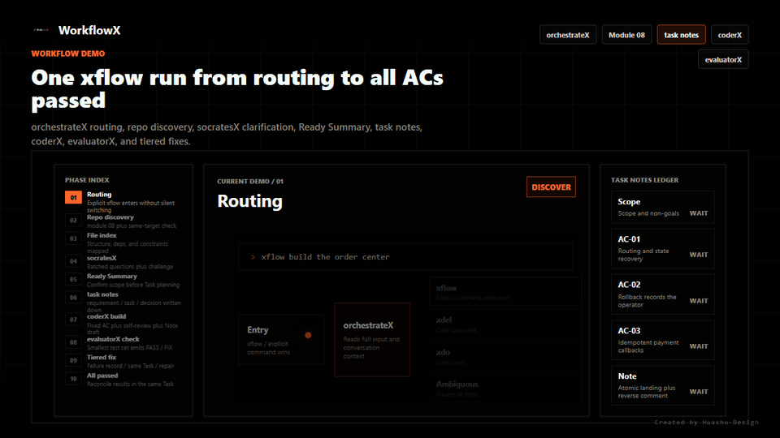
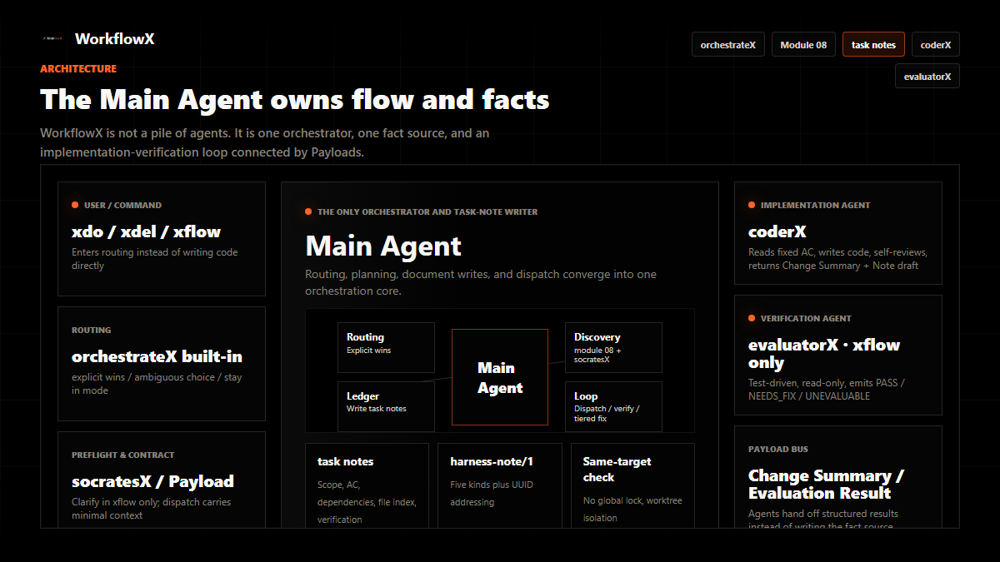
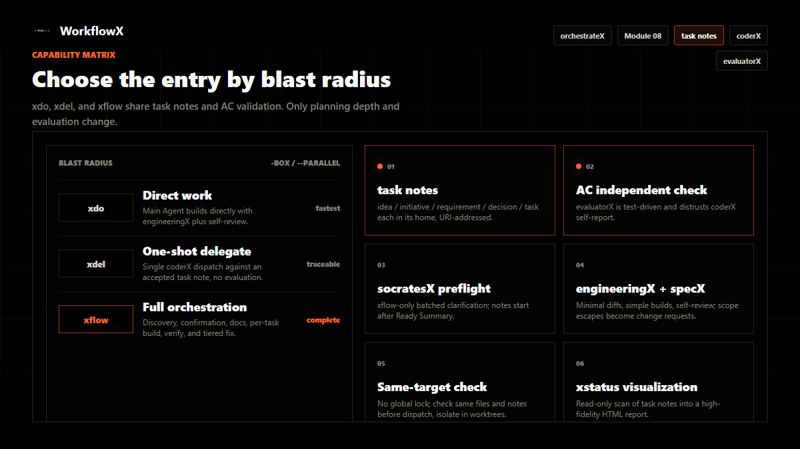
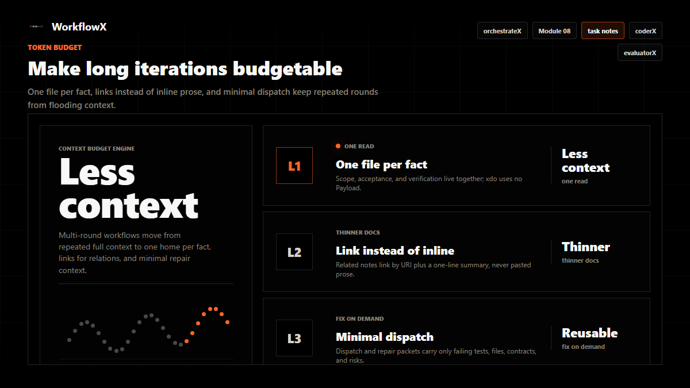

<div align="center">

[中文](./README.md) · **English**

# WorkflowX

### Make AI coding as controllable as a real team

<p align="center">
  
</p>

**A pure file-driven multi-agent framework — turning "chatting with AI to write code" into a planned, verified, traceable engineering process**

[](./LICENSE)
[](#deep-dive)
[](#deep-dive)
[](#deep-dive)


</div>

---

## What Is It?

WorkflowX is an **engineering workflow** that lives inside your AI coding tool. You still talk to one main agent, but it no longer freestyle-codes inside a long chat:

- **The Main Agent orchestrates directly**: routing, discovery, plan confirmation, task note writes (`.agents/notes/`), scheduling, document updates, and final verification.
- **coderX implements only**: reads the dispatch Task, fixed acceptance refs, and allowed scope, follows `engineeringX + specX`, self-reviews, then returns a Change Summary plus a Note draft.
- **evaluatorX verifies independently (xflow only)**: test-driven and read-only. It builds the smallest useful executable test set from the fixed AC and emits `PASS / NEEDS_FIX / UNEVALUABLE`.
- **Task notes keep the ledger**: `.agents/notes/` stores `idea / initiative / requirement / decision / task` per the `harness-note/1` standard — scope, AC, file index, dependencies, verification records, and the single `execution` state each in its home.

> There is no `orchestratorX` sub-agent and no standalone `routeX` skill: routing is merged into `orchestrateX` and the Main Agent owns orchestration directly; `xdel` / `xflow` hand off through structured Payloads only. Legacy `.hybrid/` docs, MCP, `promptX`, and `noiseX` are pre-refactor history, not runtime sources.

<p align="center">
  
  <br/>
  <sub>A complete xflow workflow: repo discovery → socratesX → Ready Summary → task notes → coderX → evaluatorX → tiered fix → atomic close</sub>
</p>

---

## Why Use It?

The real problem with single-agent AI coding is not just model quality. It is the lack of process constraints. WorkflowX turns common failure modes into explicit mechanisms:

| Failure mode | WorkflowX mechanism |
|---|---|
| **Context gets noisy and expensive** | Main Agent maintains state; execution agents work in isolated context and exchange only structured Payloads; later tasks receive only relevant contracts, files, failures, and risks |
| **Requirements disappear into chat history** | Requirements become five kinds of task notes (one file per note, URI-addressed); changes update only the relevant note and affected tasks are rescheduled by dependency |
| **AI says "done" but misses the requirement** | evaluatorX distrusts coderX self-report, builds and runs its own tests, and checks every fixed AC independently |
| **Misread requirements surface after coding** | xflow runs repository-facts exploration (module 08), phase-batched socratesX questions with proactive challenges, and creates notes only after a Ready Summary is confirmed |
| **Multi-round iteration burns tokens** | One file carries scope/acceptance/verification, related notes link by URI plus a one-line summary, and dispatch plus repair packets carry minimal context |
| **Parallel work overwrites itself** | No global lock; same-target conflict check before dispatch; worktree isolation (when supported) plus task ownership boundaries |

---

## Understand It In 30 Seconds

```text
you
│
├─ xdo / xdel / xflow / xstatus
│
▼
Main Agent
├─ orchestrateX routing: explicit command wins, otherwise recommend by blast radius; on ambiguity present all three, then stay in mode
├─ xdo: Main Agent direct work with engineeringX plus self-review; atomic landing (code + Note + entry reverse comment, one commit)
├─ xdel: one-shot coderX delegation against an accepted task note (engineeringX + specX + self-review), returns a Note draft, no evaluatorX
└─ xflow: discovery → socratesX → Ready Summary → task notes → dependency-ordered dispatch and independent evaluation
        │
        ├─ coderX: implement one task and emit Change Summary plus Note draft
        └─ evaluatorX: build the smallest test set from fixed AC, run it, emit Evaluation Result
```

<p align="center">
  
  <br/>
<sub>Main Agent works directly by default; complex modes use coderX / evaluatorX as needed (evaluatorX is xflow-only)</sub>
</p>

In one line: **Main Agent works directly by default; engineeringX provides implementation principles and self-review, while complex work adds task notes, dispatch contracts, and a test-driven evaluation chain. Atomic landing and the proseX writing standard apply across modes (gate timing exempt, standard never exempt).**

---

## Quick Start

**Requirement**: Node.js v18+

**1. Install WorkflowX**

| Platform | How to install |
|---|---|
| **Claude Code** | `/plugin marketplace add https://github.com/TreeX-X/workflowX` → `/plugin install workflowx` |
| **OpenAI Codex** | `/plugins` → search `workflowx` → Install Plugin |
| **Manual** | Copy `.claude/` or `.codex/` into the project root |

**2. Run your first requirement**

```bash
xdo implement user login with email/password and OAuth
```

> Claude Code can use slash commands. OpenAI Codex uses natural-language prefixes, for example starting the message with `xdo`.

---

## Three Modes

Choose by blast radius. If unsure, describe the requirement and the Main Agent recommends a mode from current state.

| Mode | Use case | Planning | Verify loop | Example |
|---|---|---|---|---|
| **`xdo`** | Main Agent direct work | engineeringX; task notes and harness optional; parallel only on explicit request | Main Agent self-review and verification; atomic landing | `xdo add timeout config to Config` |
| **`xdel`** | Single-task traceable delegation | Use an accepted task note (create one when none fits); one-shot coderX with self-review, returns a Note draft | evaluatorX not triggered; independent review only as a separate task on explicit request | `xdel fix order list pagination bug` |
| **`xflow`** | New feature, cross-module refactor, high-impact work | Repo discovery → socratesX → Ready Summary → task notes, dependency-ordered | evaluatorX after each task; local defects get at most one minimal repair re-dispatch by default | `xflow build the order center` |

Common flag: `-box demo` isolates work in a sandbox branch. Parallelism must be explicitly requested; the Main Agent owns scheduling, shared-file coordination, integration, and final review. There are no `-N` round or `-team` flags and no fixed iteration loop.

<p align="center">
  
</p>

---

## What Happens In xflow?

For `xflow implement user login`, the workflow is:

1. **Entry routing**: Main Agent routes from the command, complete input, and active conversation context; task notes (`.agents/notes/`) remain the durable workflow source of truth, and later input stays in the active mode.
2. **Environment init**: lightweight self-check with no global lock; delete a legacy `.hybrid/.workflow-lock` when present, check same-target conflicts before dispatch, and use sandbox or explicitly requested parallelism when needed.
3. **Repository-facts exploration (module 08)**: search structure, modules, dependencies, constraints, and conventions, separate proven facts from unknowns, and build a file index without running a second user interview.
4. **Requirement clarification (socratesX, xflow only)**: phase-batched questions across goal/scope, behavior/boundaries, implementation direction, and verification/rollout; ask only what can change scope, architecture, behavior, AC, dependencies, or risk, and offer options only for real trade-offs.
5. **Ready Summary gate**: when the request is already specified, present one Ready Summary (goal, scope, non-goals, constraints, task boundaries, affected files, verification, risks) and create notes only after confirmation.
6. **Task note generation**: Main Agent writes `requirement / task / decision` notes (plus `idea / initiative` for directions) with scope, stable `AC-n`, dependencies, file index, and verification direction; spoken agreements never enter a dispatch.
7. **coderX implementation**: implements against fixed acceptance refs and allowed scope with `engineeringX + specX`, self-reviews, then returns a Change Summary plus a Note draft (new `implemented/` or in-place sync).
8. **evaluatorX verification**: builds the smallest useful executable test set from fixed AC, runs it, and emits `PASS / NEEDS_FIX / UNEVALUABLE` with commands, failures, causes, repair scope, regression risks, and blockers; read-only, never edits code or notes.
9. **Close**: Main Agent applies tiered fixes (local defects via Repair Packet with at most one automatic re-dispatch; cross-task issues via Integration Note; architecture/scope fixed directly), narrows scope, adds checks, or records explicit risk on `UNEVALUABLE`, stops and hands to the user on exhausted budget; code + Note + entry reverse comment land in one commit following `proseX`.

---

## Deep Dive

<details>
<summary><b>Task notes: Structured Task Assets</b></summary>

Task notes (`.agents/notes/`, specified by `standards/harness-note/1/`) are WorkflowX's source of truth — one file per note, addressed by frontmatter `id` (UUID) as `note://<repo-id>/<note-id>`:

| Document | Purpose |
|---|---|
| **idea** | Hunches, questions, raw intent; park directions without blocking the Ready Summary |
| **initiative** | Cross-repo product direction, only when aggregation earns it |
| **requirement** | Needed behavior with stable `AC-n` acceptance clauses (never renumbered) |
| **task** | Bounded delivery: scope, acceptance refs, verification records, dependencies, and the single `execution` state |
| **decision** | Trade-offs: options, cost, and revisit signals; `Alternatives` always includes a do-nothing/reuse option |

The Main Agent owns routing, scheduling, document updates, and final verification. coderX reads only the dispatch plus acceptance refs and returns a self-reviewed Change Summary plus a Note draft; evaluatorX is read-only and verifies by running tests. No central index, no Parent/Child files, no plans directory; related notes link by URI plus a one-line summary. Each `implemented/` decision leaves one reverse comment at the core entry, and code + Note + comment land together with the Note path in the commit message. Legacy `.hybrid/` files are reference-only.

</details>

<details>
<summary><b>AC Cross-Validation: Evaluator Distrusts Coder (Test-Driven)</b></summary>

evaluatorX does not evaluate coderX's summary. It evaluates reality (`auditX`, xflow-only, read-only):

1. Read the task's fixed acceptance refs at a fixed revision;
2. Build executable tests for each applicable AC and run the smallest useful set (no restatement tests for small reversible changes);
3. Mark the result as `PASS / NEEDS_FIX / UNEVALUABLE`;
4. Emit test commands, failed cases, observed results, likely causes, repair scope, regression risks, and blockers; keep `NEEDS_FIX` compact enough to become a Repair Packet;
5. Let the Main Agent apply tiered fixes and update docs; reviewer identity must differ from implementer.

This turns "the AI says it is done" into "an independent quality gate confirms it is done." With no runnable test path, report `UNEVALUABLE` instead of claiming a pass.

</details>

<details>
<summary><b>Token Optimization For Multi-Round Work</b></summary>

<p align="center">
  
</p>

| Layer | Strategy | Effect |
|---|---|---|
| **L1 One file per fact** | Scope, acceptance, and verification live together; `xdo` uses no Payload | Read one fact in one place |
| **L2 Link instead of inline** | Related notes link by URI plus a one-line summary, never pasted prose | Thinner docs, reusable across sessions |
| **L3 Minimal dispatch** | Dispatch and Repair Packets carry only failing tests, relevant files, interface constraints, and risk summaries; later tasks never receive full history | At most one automatic repair re-dispatch by default |
</details>

<details>
<summary><b>orchestrateX Routing And Workflow Context</b></summary>

Routing is merged into `orchestrateX`; there is no standalone skill. Every input is routed from the complete prompt and current conversation context:

| Explicit command | `xdo / xdel / xflow` wins | Enter the requested mode immediately |
| No explicit command | High-impact, cross-module, or uncertain work | Recommend `xflow`; clear local work gets `xdel`, otherwise `xdo` |
| Ambiguous | Mode unclear | Present all three instead of silently choosing |
| In progress | Active workflow exists | Keep later input in the current mode; support incremental changes |

Default to action: an explicit command or "can you / I want / help me" intent is an execution order — finish reviewable work first, then ask once. Approval is the last step, not the first; read-only, reversible, and already-authorized work needs no extra gate. Parallelism is never implicit.

Workflow continuity lives in the active conversation plus task notes.

</details>

<details>
<summary><b>Other Built-In Capabilities</b></summary>

- **engineeringX**: keeps implementation minimal, simple, and self-reviewed; unrun checks are labeled unrun, never passed.
- **specX**: contract-reading rules for dispatched coderX (`xdel / xflow` only); out-of-scope needs become scope-change requests.
- **socratesX**: preflight clarification plus Ready Summary for `xflow` only; `xdo / xdel` never call it automatically.
- **noteX + proseX**: decision assets plus the writing standard; `xdo` is exempt from gate timing, never from the standard.
- **xstatus**: read-only scan of `.agents/notes/` into a high-fidelity HTML report; ignores legacy formats.

```bash
xstatus
xstatus --output ./reports/today.html
```

</details>

---

## Platform Support

| Platform | Config dir | Trigger style | Parallel mode |
|---|---|---|---|
| **Claude Code** | `.claude/` | `/xflow` `/xdel` `/xdo` `/xstatus` | Parallel only on explicit request; native `Agent()` dispatch, worktree when supported, otherwise recorded shared execution |
| **OpenAI Codex** | `.codex/` | Natural-language prefix: `xflow` `xdel` `xdo` `xstatus` | `xdo` is direct by default; native tool when available, otherwise prompt-spawn envelope plus receipt, degraded report instead of roleplay |

Both configs share the same logic (routing, three modes, tiered fixes); only skill paths, trigger syntax, and the dispatch adapter differ. Core skills: `orchestrateX / socratesX / engineeringX / specX / auditX / noteX / proseX`; agents: `coderX / evaluatorX`; `orchestrateX` modules: `01 / 02 / 05 / 07 / 08 / 09`.

---

## Framework Comparison

Full comparison: [comparison-report.md](docs/comparison-report.md) (historical snapshot; old modes and scores no longer track the `xdo / xdel / xflow` architecture).

| Capability | WorkflowX | Superpowers | OMC |
|---|:---:|:---:|:---:|
| Task note requirement tracking (5 kinds + harness spec) | Unique | Not supported | Not supported |
| Test-driven AC independent verification | Unique | Not supported | Not supported |
| Repo discovery + socratesX + Ready Summary | Strong | Basic | Basic |
| Minimal-context dispatch and repair packets | Systematic | Partial | Partial |
| Same-target checks + worktree isolation | Supported | Partial | Partial |
| Status report visualization | Built-in xstatus | Different implementation | Different implementation |

---

## About

WorkflowX is an open-source experimental project used in real communities. Its goal is to explore reliable process design, document structure, and quality gates for multi-agent collaborative development.

Discussions, suggestions, and contributions are welcome. Fork the repo, open a Pull Request, or share your usage scenarios and issues.

If this helps you, a star helps more people discover and test the workflow.

**Friend link**: [Linux.Do](https://linux.do/) — a community providing high-quality discussions and resource sharing for tech enthusiasts and professionals.

---

<div align="center">

[MIT License](./LICENSE) · Free to use / Modify / Redistribute · Made by [@TreeX-X](https://github.com/TreeX-X)

</div>

## Star History

<a href="https://www.star-history.com/#TreeX-X/workflowX&Date">
 <picture>
   <source media="(prefers-color-scheme: dark)" srcset="https://api.star-history.com/chart?repos=TreeX-X/workflowX&type=date&theme=dark&legend=top-left" />
   <source media="(prefers-color-scheme: light)" srcset="https://api.star-history.com/chart?repos=TreeX-X/workflowX&type=date&theme=dark&legend=top-left" />
   
 </picture>
</a>
