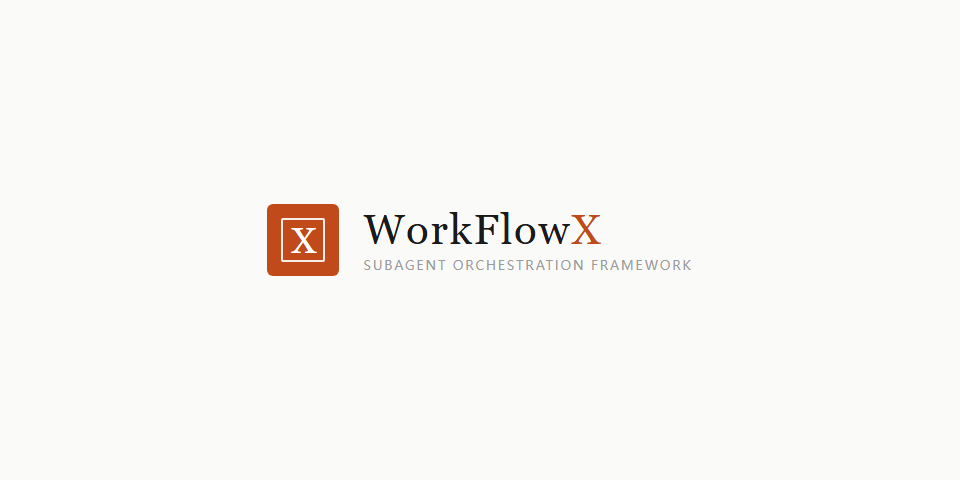
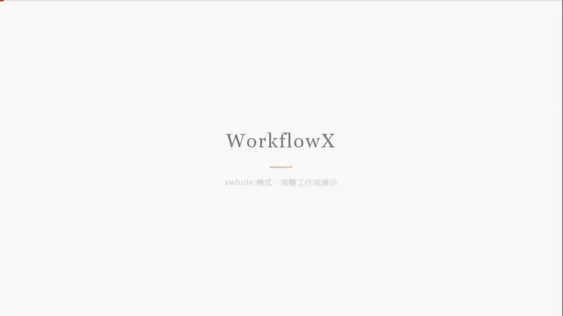
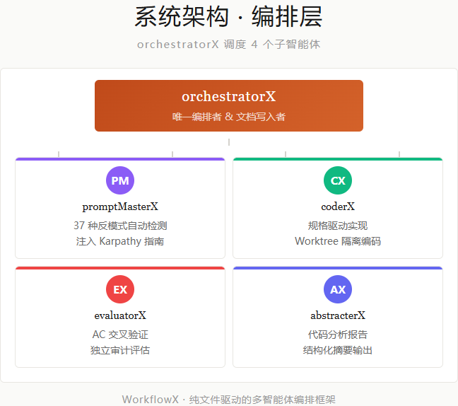
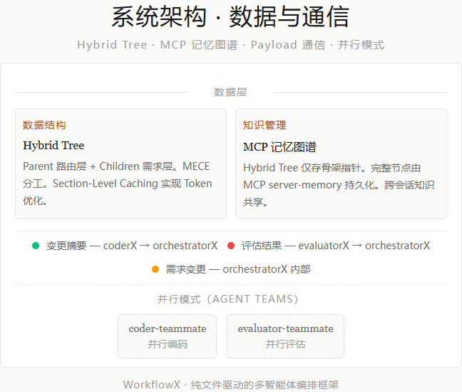
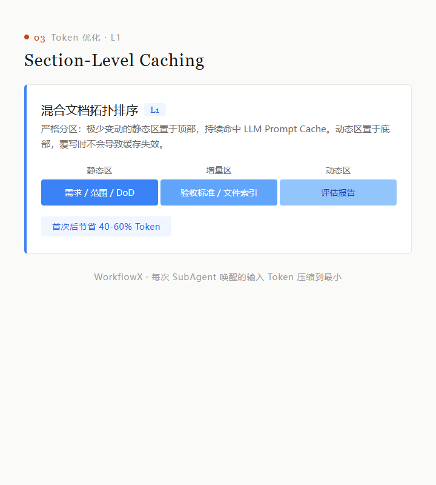
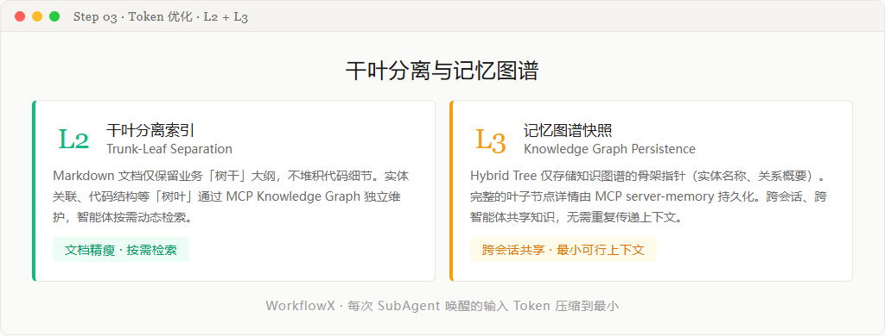
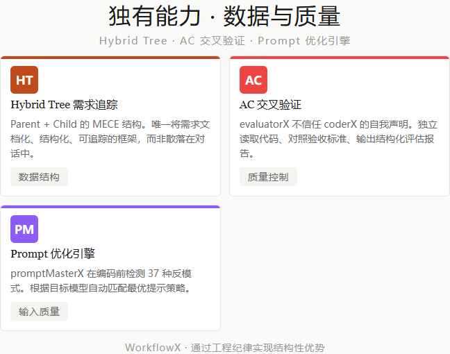
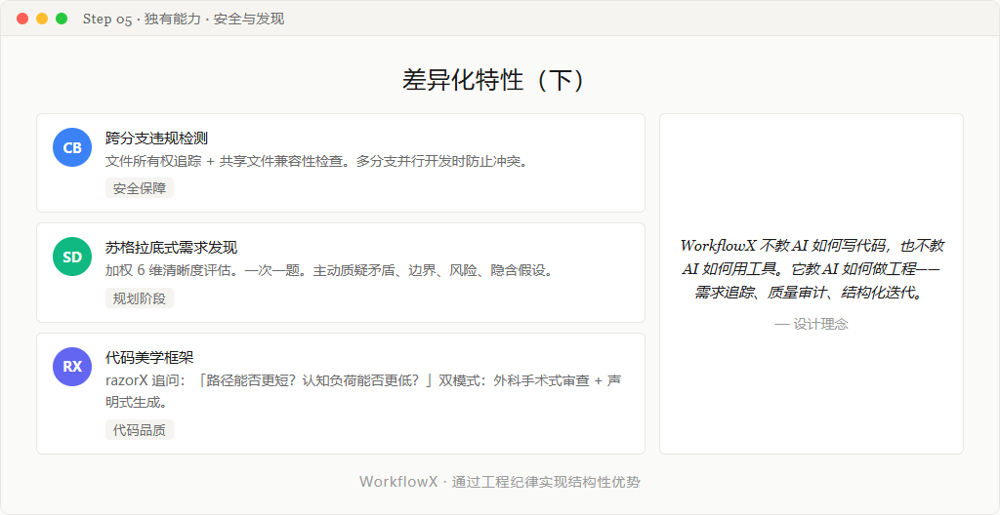

<div align="center">

**中文** · [English](./README.en.md)

# WorkflowX

### 混合文档驱动的多智能体协作框架



**纯文件驱动 · 零依赖部署 · 结构化需求追踪 · AC 交叉验证 · Token 极致优化**

[](./LICENSE)
[](#-核心能力)
[](#-核心能力)
[](#-核心能力)


</div>

---

## 工作流演示

<p align="center">
  
  <br/>
  <sub>xwhole 模式完整工作流：需求输入 → promptMasterX 优化 → coderX 编码 → evaluatorX 验证 → 迭代完成</sub>
</p>

---

## 设计理念

> **通过纯净独立的上下文保持智能体的最高水准状态，通过混合文档（Hybrid Docs）实现优雅的自动化与半自动化无缝切换。**

<table>
<tr>
<td width="50%">

**单一写入者，状态一致**
orchestratorX 是唯一的文档写入者，杜绝多源冲突。所有子智能体（coderX、evaluatorX）均为只读 + Payload 输出，不直接写入文档。

</td>
<td width="50%">

**零依赖部署，配置即运行**
纯 Markdown 驱动，无需安装服务、无需搭建运行时。将配置文件拷贝到项目中即可完成部署。

</td>
</tr>
<tr>
<td>

**降低幻觉成本，极限提升单步效率**
纯净上下文 + 结构化 Payload 通信 + Worktree 物理隔离，将每次 SubAgent 唤醒的输入 Token 压缩到最小。

</td>
<td>

**单点切入，全局联动**
需求变更自动传播，依赖自动排队重试。Hybrid Tree 的 MECE 结构确保每个任务都有明确的负责人和验收标准。

</td>
</tr>
</table>

---

## 系统架构

**orchestratorX** 是唯一文档写入者，通过 Bus Payload 调度子智能体：

- **Bus Payload 通信** — 3 种结构化 Payload（Change Summary / Evaluation Result / Requirement Change），零上下文污染
- **Hybrid Tree** — Parent 路由层 + Children 需求层，MECE 分工，Section-Level Caching
- **Worktree 隔离** — 每个子智能体在独立 git worktree 中工作，物理隔离
- **AC 交叉验证** — evaluatorX 不信任 coderX 声明，独立验证每个验收标准

<p align="center">
  
  <br/>
  <sub>编排层：orchestratorX 调度 4 个子智能体（promptMasterX / coderX / evaluatorX / abstracterX）</sub>
</p>
<p align="center">
  
  <br/>
  <sub>数据层：Hybrid Tree + MCP 记忆图谱 + Payload 通信 + 并行模式</sub>
</p>

---

## 核心能力

### 苏格拉底式需求发现 (Module 08)

> 规划阶段暴露隐藏假设和边界条件，而非在编码后才发现需求偏差。

- **加权清晰度评估**：6 维度加权打分（目标用户 15% / 功能范围 25% / 技术约束 20% / 边界条件 15% / 验收标准 15% / 非功能需求 10%）
- **一次一题，优先多选**：每个问题基于上一个回答，层层深入
- **主动质疑**：即使需求清晰，也必须分析矛盾、边界、风险、隐含假设、跨模块冲突、遗漏的非功能需求

### Prompt 优化引擎 (promptMasterX)

内置 **prompt-master** 技能，为 20+ 种 AI 工具生成生产级提示词：

- **9 维意图解析**：静默分析任务、目标工具、输出格式、约束条件等维度
- **工具专属路由**：根据目标模型自动匹配最优提示策略（如推理模型不追加 CoT）
- **6 类故障扫描**：自动检测并修复任务歧义、上下文缺失、格式偏差等常见问题
- **一键即用**：输出可直接复制粘贴的提示词块，零二次修改

### 三层 Token 优化

> 多轮迭代场景节省 40-60%，每次 SubAgent 唤醒的输入 Token 压缩到最小。

<p align="center">
  
  <br/>
  <sub>L1：混合文档拓扑排序，严格分区命中 LLM Prompt Cache</sub>
</p>
<p align="center">
  
  <br/>
  <sub>L2 干叶分离 + L3 记忆图谱快照：文档精瘦、按需检索、跨会话共享</sub>
</p>

| 层 | 策略 | 效果 |
|---|------|------|
| **L1: Section-Level Caching** | 混合文档严格分区：极少变动的静态区（需求/范围/DoD）置顶命中 LLM Prompt Cache，动态区（评估报告）底部覆写不影响缓存 | 首次后节省 40-60% |
| **L2: 干叶分离索引** | Markdown 仅保留业务「树干」大纲，实体关联等「树叶」由 MCP Knowledge Graph 独立维护，按需动态检索 | 文档精瘦 · 按需检索 |
| **L3: 记忆图谱快照** | Hybrid Tree 仅存骨架指针（实体名称、关系概要），完整节点由 MCP server-memory 持久化 | 跨会话共享 · 最小可行上下文 |

### AC 交叉验证

**evaluatorX 不信任 coderX 的自我声明**——它独立读取代码、对照验收标准、输出结构化评估报告（AC 状态表：pass / partial / fail / unevaluable + P0/P1/P2 问题列表 + 修复指令）。

### 代码美学框架 (razorX)

> "路径能否更短？认知负荷能否更低？"

双模式工作：
- **Review 模式**：逐行扫描，外科手术式优化
- **Generation 模式**：声明式、stdlib 优先、可组合函数

### 工作流状态可视化 (`/xstatus`)

一条指令生成高保真 HTML 状态报告，基于 `huashu-design` 设计语言——暖白底 + 衬线 display 字体 + rust 橙 accent，反 AI slop。

```bash
/xstatus                            # 输出到 ./status-report.html 并打开
/xstatus --output ./reports/today.html  # 输出到指定路径
```

---

## 快速开始

### 环境要求

- Node.js v18+
- MCP 工具：`npm install -g @modelcontextprotocol/server-memory @modelcontextprotocol/server-sequential-thinking`

### 安装

**方式一：Plugin Marketplace（推荐）**

| 平台 | 安装命令 |
|------|----------|
| **Claude Code** | `/plugin marketplace add https://github.com/TreeX-X/workflowX` → `/plugin install workflowx` |
| **OpenAI Codex** | `/plugins` → 搜索 `workflowx` → Install Plugin |
| **GitHub Copilot** | `copilot plugin marketplace add https://github.com/TreeX-X/workflowX` → `copilot plugin install workflowx@workflowx` |
| **OpenCode** | 在 `opencode.json` 中添加 `"plugin": ["workflowx@git+https://github.com/TreeX-X/workflowX.git"]` |

**方式二：手动部署**

```bash
# 1. 复制配置目录到项目根目录
cp -r .claude/ /your/project/

# 2. 安装 MCP 依赖
npm install -g @modelcontextprotocol/server-memory @modelcontextprotocol/server-sequential-thinking

# 3. 在 AI 客户端中挂载 MCP 配置（参考 mcp.json.template）
```

---

## 使用指南

### 指令速查

| 指令 | 说明 | 示例 |
|------|------|------|
| `xwhole [需求]` | 全仓库级完整工作流（规划 → 编码 → 评估） | `xwhole 实现用户登录模块` |
| `/xwhole -parallel [需求]` | **并行工作流**，多个子任务同时执行（仅 Claude Code） | `/xwhole -parallel 实现用户、订单、商品三个独立模块` |
| `xwhole -box demo` | 在沙箱分支 `demo` 中执行，隔离主线 | `xwhole -box auth 重构鉴权逻辑` |
| `xwhole -N 3` | 限定评估最多迭代 3 轮（默认 2 轮） | `xwhole -N 3 优化数据库查询性能` |jiang
| `xlocal [需求]` | 局部模块开发，跳过 PRD 规划阶段 | `xlocal 修复订单列表分页 bug` |
| `xunit [需求]` | 最小单元任务，直接修改，无评估 | `xunit 给 Config 类添加超时配置` |
| `xstatus` | 生成 HTML 工作流状态报告 | `xstatus` 或 `xstatus --output ./reports/today.html` |
| `xprompt [文本]` | 仅优化提示词，不触发开发流程 | `xprompt 帮我写一个登录页面的提示词` |

> 默认行为：所有开发类请求会自动路由经过 orchestratorX。纯文件读取、配置修改、Git 操作等例外场景可直接执行。
> OpenAI Codex 不支持项目自定义 slash command，请使用无斜杠的自然语言触发词，例如 `xwhole 实现用户登录模块`。Claude Code / OpenCode 等支持 slash command 的平台可继续使用 `/xwhole`。

### 工作流模式

四种模式覆盖从全仓库到单文件的完整粒度，自动路由到 orchestratorX：

| | `xwhole` 全局模式 | `/xwhole -parallel` 并行模式 | `xlocal` 局部模式 | `xunit` 单元模式 |
|---|---|---|---|---|
| **适用场景** | 新功能、跨模块重构 | 多个独立子任务并行执行 | 1-2 个模块内的修改 | 单文件修复、小改动 |
| **平台支持** | 全平台 | **仅 Claude Code** | 全平台 | 全平台 |
| **PRD 规划** | 多轮对话 → Hybrid Tree | 同 xwhole → 自动拆分并行任务 | 跳过 | 跳过 |
| **评估迭代** | evaluatorX 自动，最多 N 轮 | 多 evaluator-teammate 并行 | evaluatorX，最多 N 轮 | 仅明确要求时 |
| **需求发现** | Module 08 (苏格拉底 + 主动质疑) | 同 xwhole | Module 08 (轻量) | 跳过 |
| **Worktree 隔离** | ✅ | ✅ | ✅ | ❌ |

> `/xwhole -parallel` 依赖 Claude Code 的实验性 Agent Teams 功能（`CLAUDE_CODE_EXPERIMENTAL_AGENT_TEAMS=1`）。

### 实战示例：一次完整的 `xwhole` 工作流

```
① 发起请求
   xwhole 实现用户登录功能，支持邮箱+密码和 OAuth 两种方式

② orchestratorX 自动路由到 whole 模式
   → 苏格拉底式追问澄清需求边界（Module 08）
   → 主动质疑：OAuth token 刷新策略？并发登录限制？
   → 多轮规划对话，生成 Hybrid Tree
   → 您审阅文档，确认需求无误后回复"确认"

③ promptMasterX 优化执行指令
   → 检测 37 种反模式，输出精确的 coderX 执行提示词

④ coderX 编码实现
   → 输出 Change Summary Payload

⑤ evaluatorX 独立审计（AC 交叉验证）
   → 输出 Evaluation Result Payload（AC 状态表 + 问题列表）

⑥ 迭代完成
   → evaluatorX 确认 PASS，Hybrid Tree 收口为最终版本
```

---

## 框架对比

> 完整对比分析（含架构、Token 消耗、AI 痛点解决、评分明细）请参阅 [comparison-report.md](docs/comparison-report.md)。

### 加权评分（满分 100）

| 大类 (权重) | WorkflowX | Superpowers | OMC |
|-------------|:---------:|:-----------:|:---:|
| 架构与设计 (25%) | **9.15** | 6.70 | 7.40 |
| 工作流与流程 (30%) | **9.20** | 7.60 | 7.50 |
| 质量与可靠性 (25%) | 7.85 | **8.55** | 7.70 |
| 平台与生态 (20%) | 6.40 | **9.60** | 6.60 |
| **加权总分** | **83** | **80** | **73** |

### 核心能力对比

| 能力 | WorkflowX | Superpowers | OMC |
|------|:---------:|:-----------:|:---:|
| **Hybrid Tree 需求追踪** | ✅ 独有 | ❌ | ❌ |
| **AC 交叉验证** | ✅ 独有 | ❌ | ❌ |
| **Prompt 优化引擎** | ✅ 独有 | ❌ | ❌ |
| **跨分支违规检测** | ✅ 独有 | ❌ | ❌ |
| **苏格拉底式需求发现** | ✅ 加权清晰度 + 主动质疑 | ✅ 基础 | ✅ 基础 |
| **代码美学框架** | ✅ 独有 | ❌ | ❌ |
| **Token 增量优化** | ✅ 系统化 | 部分 | 部分 |
| **TDD 铁律** | ❌ | ✅ 最严格 | 部分 |
| **系统化调试** | ❌ | ✅ 四阶段法 | 部分 |
| **智能模型路由** | ❌ | ❌ | ✅ |
| **多 AI 交叉验证** | ❌ | ❌ | ✅ |
| **安全审查 (OWASP)** | 部分 | ❌ | ✅ 专业 |
| **多平台原生** | 4 平台 | 8 平台 | 2 平台 |

<p align="center">
  
  <br/>
  <sub>Hybrid Tree 需求追踪 / AC 交叉验证 / Prompt 优化引擎</sub>
</p>
<p align="center">
  
  <br/>
  <sub>跨分支违规检测 / 苏格拉底式需求发现 / 代码美学框架</sub>
</p>

### 为什么选择 WorkflowX？

<table>
<tr>
<td width="50%">

**结构化最强**
Hybrid Tree 将需求文档化、结构化、可追踪，而非散落在对话中。Parent + Child 的 MECE 结构确保每个任务都有明确的验收标准。

**质量控制最严**
evaluatorX 通过 AC 交叉验证独立核实每个验收标准，不信任 coderX 的自我声明。跨分支违规检测防止多分支并行冲突。

</td>
<td width="50%">

**Token 最省**
Section 级缓存 + 增量上下文传递 + prompt 压缩，多轮迭代场景节省 40-60%。独立迭代计数器 + 早退机制避免无效消耗。

**需求发现最深**
加权 6 维清晰度评估 + 苏格拉底式追问 + 主动质疑机制（矛盾/边界/风险/假设/冲突/遗漏），在规划阶段而非编码后暴露问题。

</td>
</tr>
</table>

---

## 平台支持

| 平台 | 配置目录 | 支持模式 | 说明 |
|------|----------|----------|------|
| **Claude Code** | `.claude/` | 全部 4 种模式 | agents + skills，原生 SubAgent + Agent Teams（并行） |
| **OpenAI Codex** | `.codex/` | 3 种模式 | agents (`.toml`) + skills，自然语言模式别名 |
| **GitHub Copilot** | `.github/` | 3 种模式 | agents (`.agent.md`) + skills + instructions |
| **OpenCode** | `.opencode/` | 3 种模式 | agents + commands + skills，Task tool 委派 |

> 四套配置的工作流逻辑完全一致，仅工具调用语法因平台而异。所有模式均自动启用 Worktree 隔离（xunit 除外）。

---

## 关于

这是真实投入各个社区使用的一个开源实验性项目，旨在探索多智能体协同开发的最佳实践与架构设计。

欢迎任何形式的讨论、建议与贡献！
如何贡献：Fork 本仓库，提交 Pull Request，或直接在 Issues 中提出你的想法。

公众号：[TreeX-AI]

如果开源对你有帮助，欢迎点亮 ⭐，让更多人加入一起探索 AI 开发的未来！

---

## 友情链接

- [Linux.Do](https://linux.do/) — 致力于为技术爱好者和专业人士提供高质量的讨论和资源分享环境

---

<div align="center">

[MIT License](./LICENSE) · 自由使用 / 修改 / 再分发

Made by [@TreeX-X](https://github.com/TreeX-X)

</div>

## ⭐ 星级历史

<a href="https://www.star-history.com/#TreeX-X/workflowX&Date">
 <picture>
   <source media="(prefers-color-scheme: dark)" srcset="https://api.star-history.com/chart?repos=TreeX-X/workflowX&type=date&theme=dark&legend=top-left" />
   <source media="(prefers-color-scheme: light)" srcset="https://api.star-history.com/chart?repos=TreeX-X/workflowX&type=date&theme=light&legend=top-left" />
   
 </picture>
</a>
