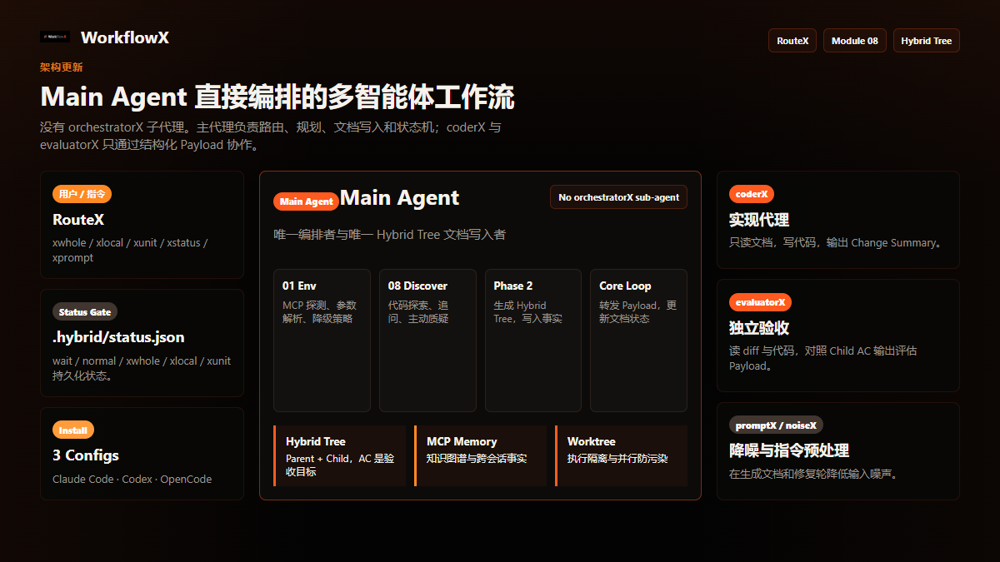
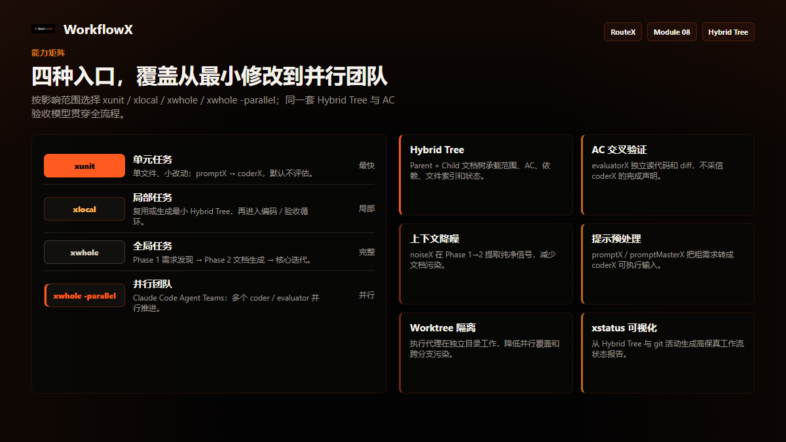
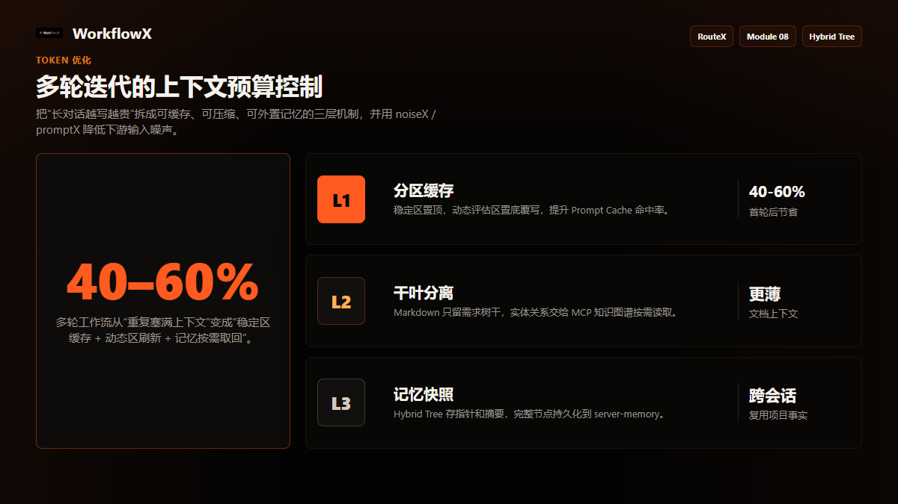

<div align="center">

**中文** · [English](./README.en.md)

# WorkflowX

### 让 AI 写代码像团队协作一样可控

<p align="center">
  
</p>

**一个纯文件驱动的多智能体协作框架 —— 把"和 AI 聊天写代码"升级为"有规划、有验收、可追踪"的工程流程**

[](./LICENSE)
[](#深入设计)
[](#深入设计)
[](#深入设计)


</div>

---

## 这是什么？

WorkflowX 是一套放进 AI 编程工具里的**工程化工作流**。你仍然只和一个主代理对话，但它不再“边聊边写”：

- **Main Agent 直接编排**：负责路由、需求发现、方案确认、Hybrid Tree 文档写入、状态机和任务派发。
- **coderX 只负责实现**：读取需求文档和执行指令，写代码，返回结构化 Change Summary。
- **evaluatorX 独立验收**：读取真实代码与 diff，对照验收标准逐条核验，失败就生成修复指令。
- **Hybrid Tree 记账**：Parent + Child 文档树沉淀范围、AC、文件索引、依赖、评估结果和状态。

> 最新架构中没有 `orchestratorX` 子代理。编排职责由 Main Agent 直接承担；执行代理只通过结构化 Payload 交接。

<p align="center">
  
  <br/>
  <sub>一次完整 xwhole：RouteX 状态门控 → 需求发现 → 用户确认 → noiseX 降噪 → Hybrid Tree → coderX → evaluatorX → 修复回流 → PASS 收口</sub>
</p>

---

## 为什么需要它？

单个 AI 长对话写代码，真正的问题不是“模型不够聪明”，而是流程没有约束。WorkflowX 把常见失控点变成明确机制：

| 痛点 | WorkflowX 的处理方式 |
|---|---|
| **上下文越聊越乱** | Main Agent 维护状态，执行代理独立上下文工作，只通过 Payload 传递必要信息 |
| **需求散落在聊天里** | 需求落到 Hybrid Tree，变更只改对应 Section，受影响 Child 重新进入循环 |
| **AI 自称完成但没达标** | evaluatorX 不信任 coderX 自述，独立读代码、读 diff、逐条核对 AC |
| **编码后才发现需求误解** | xwhole Phase 1 先做代码探索、苏格拉底式追问和主动质疑，再进入文档生成 |
| **多轮迭代 Token 成本高** | 分区缓存、干叶分离、MCP 记忆快照、noiseX 降噪共同控制上下文预算 |
| **并行任务相互覆盖** | worktree 隔离 + Child 责任边界 + 跨分支违规检测 |

---

## 30 秒理解工作原理

```text
你
│
├─ xwhole / xlocal / xunit / xstatus / xprompt
│
▼
Main Agent
├─ RouteX：读取 .hybrid/status.json，判断是继续、探索还是启动工作流
├─ Module 08：xwhole 需求发现、方案设计、Hard Gate 确认
├─ Phase 2：生成或维护 Hybrid Tree（Main Agent 唯一文档写入者）
└─ Core Loop：转发 Payload，驱动 coderX ↔ evaluatorX 迭代
        │
        ├─ coderX：实现并输出 Change Summary
        └─ evaluatorX：独立验收并输出 Evaluation Result
```

<p align="center">
  
  <br/>
  <sub>Main Agent 集中编排与写文档；coderX / evaluatorX / promptX / noiseX 作为执行或辅助单元进入循环</sub>
</p>

一句话：**Main Agent 管流程和事实，coderX 写代码，evaluatorX 把关，Hybrid Tree 保持可追踪。**

---

## 快速开始

**环境要求**：Node.js v18+

**1. 安装 MCP 依赖**（用于跨会话记忆）

```bash
npm install -g @modelcontextprotocol/server-memory @modelcontextprotocol/server-sequential-thinking
```

**2. 安装 WorkflowX**

| 平台 | 安装方式 |
|---|---|
| **Claude Code** | `/plugin marketplace add https://github.com/TreeX-X/workflowX` → `/plugin install workflowx` |
| **OpenAI Codex** | `/plugins` → 搜索 `workflowx` → Install Plugin |
| **OpenCode** | 在 `opencode.json` 添加 `"plugin": ["workflowx@git+https://github.com/TreeX-X/workflowX.git"]` |
| **手动部署** | 把 `.claude/`、`.codex/` 或 `.opencode/` 拷进项目根目录，再按 `mcp.json.template` 挂载 MCP |

**3. 跑第一条需求**

```bash
xwhole 实现用户登录功能，支持邮箱密码和 OAuth
```

> Claude Code / OpenCode 可用斜杠命令；OpenAI Codex 使用自然语言前缀，例如直接以 `xwhole` 开头。

---

## 四种模式

按改动影响范围选择。拿不准时直接描述需求，RouteX 会结合状态推荐模式。

| 模式 | 适用场景 | 规划方式 | 验收循环 | 示例 |
|---|---|---|---|---|
| **`xunit`** | 单文件、小改动、明确修复 | promptX 提炼意图 | 默认不启用 evaluatorX | `xunit 给 Config 加超时配置` |
| **`xlocal`** | 1-2 个模块内的修复或局部功能 | 复用/生成最小 Hybrid Tree | 自动，最多 N 轮 | `xlocal 修复订单列表分页 bug` |
| **`xwhole`** | 新功能、跨模块重构、高影响任务 | Phase 1 需求发现 → Phase 2 文档生成 | 自动，最多 N 轮 | `xwhole 实现订单中心` |
| **`xwhole -parallel`** | 多个独立子任务并行推进 | 生成 Hybrid Tree 后按 Child 并行 | 多 coder / evaluator 并行 | `/xwhole -parallel 实现用户、订单、商品模块` |

常用参数：`-N 3` 限制每个 Child 最多验收迭代 3 轮；`-box demo` 在沙箱分支隔离执行；`-parallel` 仅 Claude Code Agent Teams 支持。

<p align="center">
  
</p>

---

## 一次 xwhole 会发生什么？

以 `xwhole 实现用户登录功能` 为例，完整流程分成 10 个动作：

1. **入口路由**：Main Agent 读取 `.hybrid/status.json`，决定启动新流程或接入现有流程。
2. **环境初始化**：解析 `-N` / `-box` / `-parallel`，探测 MCP，可降级运行。
3. **代码探索**：先搜索项目结构、相关模块和已有约束，形成文件索引。
4. **需求发现**：用 socratesX 一次一题澄清边界，并主动挑战矛盾、遗漏和技术风险。
5. **Hard Gate 确认**：用户确认方案后才允许进入文档生成。
6. **noiseX 降噪**：把 Phase 1 中的探索、废弃假设和确认事实提炼成干净信号。
7. **生成 Hybrid Tree**：Main Agent 写 Parent / Child，包含范围、AC、依赖和文件索引。
8. **coderX 实现**：按 Child AC 写代码，完成后输出 Change Summary Payload。
9. **evaluatorX 验收**：独立读 diff 和代码，输出 AC 状态、问题等级和修复指令。
10. **收口或回流**：PASS 则更新文档并结束；失败则 Main Agent 把修复指令传回 coderX，直到通过或达到 N 轮上限。

---

## 深入设计

<details>
<summary><b>Hybrid Tree：结构化需求文档树</b></summary>

Hybrid Tree 是 WorkflowX 的事实来源：

| 文档 | 作用 |
|---|---|
| **Parent** | 全局范围、NFR、DoD、路由表、共享文件索引、知识图谱概要、Child 状态聚合 |
| **Child** | 子任务范围、验收标准 AC、私有文件索引、实现摘要、评估结果和迭代记录 |

Main Agent 是唯一文档写入者。coderX 和 evaluatorX 只读文档、输出 Payload，避免多个代理同时改同一份事实来源。

</details>

<details>
<summary><b>AC 交叉验证：评估员不信任程序员</b></summary>

evaluatorX 的验收目标不是“看 coderX 写了什么总结”，而是：

1. 读取 Child 的验收标准；
2. 读取 git diff 和相关源码；
3. 对每条 AC 标记 `pass / partial / fail / unevaluable`；
4. 输出 P0/P1/P2 问题和可执行修复指令；
5. 由 Main Agent 更新文档并决定是否回流。

这让“AI 说完成了”变成“独立质量门确认完成”。

</details>

<details>
<summary><b>Token 优化：多轮迭代省上下文</b></summary>

<p align="center">
  
</p>

| 层 | 策略 | 作用 |
|---|---|---|
| **L1 分区缓存** | 稳定区置顶，动态区置底覆写 | 提高 Prompt Cache 命中率 |
| **L2 干叶分离** | Markdown 只保留需求树干，实体关系交给 MCP 知识图谱 | 减少文档体积 |
| **L3 记忆快照** | Hybrid Tree 存摘要和指针，完整节点持久化到 server-memory | 跨会话复用事实 |

配套的 noiseX 和 promptX 分别解决“规划阶段噪声污染文档”和“修复轮输入过散”的问题。

</details>

<details>
<summary><b>RouteX 与状态机</b></summary>

所有输入先经过状态门控：

| 路由 | 触发条件 | 处理方式 |
|---|---|---|
| **Route 0** | 当前已有活跃工作流 | 把用户输入作为当前流程的一部分，支持需求增量变更 |
| **Route 1** | 只读探索、搜索、git、配置操作 | 直接处理，不派 coderX |
| **Route 2** | 有编码意图且状态空闲 | 分析范围，推荐 xwhole / xlocal / xunit，需用户确认 |
| **Route 3** | 显式 `xwhole` / `xlocal` / `xunit` 等命令 | 按指定模式立即进入 |

状态保存在 `.hybrid/status.json`：`wait`、`normal`、`xwhole`、`xlocal`、`xunit`。会话中断后可根据状态恢复。

</details>

<details>
<summary><b>其他内置能力</b></summary>

- **promptX / promptMasterX**：把粗需求或修复指令转成 coderX 更容易执行的结构化输入。
- **noiseX**：在 xwhole Phase 1 → Phase 2 之间清理对话噪声，避免把废弃假设写进 PRD。
- **razorX**：用“路径能否更短、认知负担能否更低”约束实现与 review。
- **guideX**：约束 coderX 避免过度设计、虚假完成和无验证修改。
- **xstatus**：生成高保真 HTML 工作流状态报告。

```bash
xstatus
xstatus --output ./reports/today.html
```

</details>

---

## 平台支持

| 平台 | 配置目录 | 触发方式 | 并行模式 |
|---|---|---|---|
| **Claude Code** | `.claude/` | `/xwhole` `/xlocal` `/xunit` `/xstatus` `/xprompt` | 支持 `/xwhole -parallel` |
| **OpenAI Codex** | `.codex/` | 自然语言前缀：`xwhole` `xlocal` `xunit` `xstatus` `xprompt` | 不支持 |
| **OpenCode** | `.opencode/` | `/xwhole` `/xlocal` `/xunit` `/xstatus` `/xprompt` | 不支持 |

三套配置共享同一套工作流思想，但会根据宿主工具能力调整触发语法、子代理调用方式和并行能力。

---

## 框架对比

完整对比见 [comparison-report.md](docs/comparison-report.md)。

| 能力 | WorkflowX | Superpowers | OMC |
|---|:---:|:---:|:---:|
| Hybrid Tree 需求追踪 | 独有 | 不支持 | 不支持 |
| AC 交叉验证 | 独有 | 不支持 | 不支持 |
| Phase 1 需求发现 + 主动质疑 | 强 | 基础 | 基础 |
| Token 增量优化 | 系统化 | 部分 | 部分 |
| Worktree 隔离与跨分支检测 | 支持 | 部分 | 部分 |
| 多平台配置 | Claude / Codex / OpenCode | 多平台 | 有限 |
| 状态报告可视化 | 内置 xstatus | 不同实现 | 不同实现 |

---

## 关于

WorkflowX 是一个真实投入社区使用的开源实验项目，目标是探索多智能体协同开发的可靠流程、文档结构和质量门。

欢迎讨论、建议与贡献。Fork 本仓库提交 Pull Request，或在 Issues 中分享你的使用场景与问题。

公众号：**TreeX-AI** · 如果对你有帮助，欢迎 Star。

**友情链接**：[Linux.Do](https://linux.do/) —— 为技术爱好者和专业人士提供高质量讨论与资源分享的社区。

---

<div align="center">

[MIT License](./LICENSE) · 自由使用 / 修改 / 再分发 · Made by [@TreeX-X](https://github.com/TreeX-X)

</div>

## 星级历史

<a href="https://www.star-history.com/#TreeX-X/workflowX&Date">
 <picture>
   <source media="(prefers-color-scheme: dark)" srcset="https://api.star-history.com/chart?repos=TreeX-X/workflowX&type=date&theme=dark&legend=top-left" />
   <source media="(prefers-color-scheme: light)" srcset="https://api.star-history.com/chart?repos=TreeX-X/workflowX&type=date&theme=dark&legend=top-left" />
   
 </picture>
</a>
