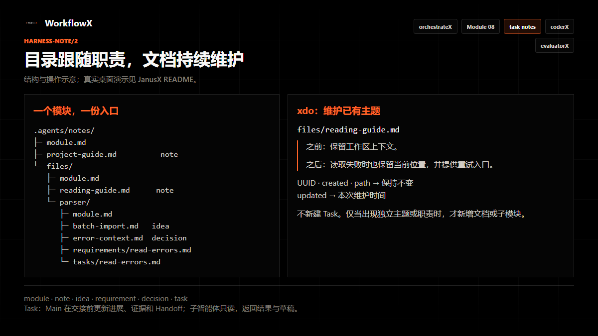

<div align="center">

**中文** · [English](./README.en.md)

# WorkflowX

### 让 AI 写代码像团队协作一样可控

<p align="center">
  
</p>

**一个纯文件驱动的多智能体协作框架 —— 把"和 AI 聊天写代码"升级为"有规划、有验收、可追踪"的工程流程**

[](./LICENSE)
[](#深入设计)
[](#深入设计)
[](#深入设计)


</div>

---

## 这是什么？

WorkflowX 是一套放进 AI 编程工具里的**工程化工作流**。你仍然只和一个主代理对话，但它不再“边聊边写”：

- **Main Agent 直接编排**：负责路由、需求发现、方案确认、task note 写入（`.agents/notes/`）、调度、文档更新和最终验证。
- **coderX 只负责实现**：读取派发 Task、固定验收引用和允许范围，遵循 `engineeringX + specX` 写代码，自审后返回 Change Summary 与 Note 草稿。
- **evaluatorX 独立验收（仅 xflow）**：测试驱动，只读不改，按固定 AC 建最小可执行测试集并运行，输出 `PASS / NEEDS_FIX / UNEVALUABLE`。
- **模块文档持续维护**：`.agents/notes/` 按 `harness-note/2` 组织模块、通用 Note、想法、需求、决策和任务；每模块一入口，主 Agent 在交接前维护共享 Task，普通 `xdo` 不创建 Task。
- **Wiki 与蓝图共用 Note**：工程 wiki 直读原文，正式关系与正文引用分开，反链由索引派生；知识 wiki 记录实际读取的 Note 来源及哈希。双端 noteX 已接入[共同读取契约](.agents/notes/harness/wiki/shared-index.md)，宿主读取和界面接入按[实施计划](.agents/notes/harness/requirements/corpus-readiness.md)推进。

> 当前架构没有 `orchestratorX` 子代理，也没有独立 `routeX` skill：路由已合并进 `orchestrateX`，编排由 Main Agent 直接承担；`xdel / xflow` 只通过结构化 Payload 交接。旧 `.hybrid/` 文档与 MCP / `promptX` / `noiseX` 属于重构前历史，不再作为运行依据。

<p align="center">
  
  <br/>
  <sub>xflow 流程示意：仓库发现 → socratesX → Ready Summary → Task → coderX → evaluatorX → 修复与交接。图中结果是教学示例，不是本仓验收证据。</sub>
</p>

---

## 为什么需要它？

单个 AI 长对话写代码，真正的问题不是“模型不够聪明”，而是流程没有约束。WorkflowX 把常见失控点变成明确机制：

| 痛点 | WorkflowX 的处理方式 |
|---|---|
| **上下文越聊越乱** | Main Agent 维护状态，执行代理独立上下文工作，只通过 Payload 传递必要信息；后续 task 只传相关契约、文件、失败与风险，不回传完整历史 |
| **需求散落在聊天里** | 模块文档与六类 Note 通过 URI 寻址；同一主题原位维护，受影响 Task 按依赖调度 |
| **AI 自称完成但没达标** | evaluatorX 不信任 coderX 自述，独立建测试并运行，逐条核对固定 AC，输出测试结果与失败记录 |
| **编码后才发现需求误解** | xflow 先做仓库事实探索（module 08）、按阶段批量澄清的 socratesX 追问和主动质疑，经 Ready Summary 确认后才建 note |
| **多轮迭代 Token 成本高** | 单文件承载范围/验收/验证、关联笔记只用 URI + 一行摘要链接、派发与修复包只带最小上下文 |
| **并行任务相互覆盖** | 无全局锁，派发前只做同目标冲突检查；worktree 隔离（宿主支持时）+ task 责任边界 |

---

## 30 秒理解工作原理

```text
你
│
├─ xdo / xdel / xflow / xstatus
│
▼
Main Agent
├─ orchestrateX 路由：显式命令优先；清晰本地工作默认 xdo，未决范围按需澄清
├─ xdo：主 Agent 直接工作，engineeringX + 自审；不新建 Task，原位维护相关文档
├─ xdel：基于已验收 task note 单次委托 coderX（engineeringX + specX + 自审），带回 Note 草稿，不触发 evaluatorX
└─ xflow：仓库发现 → socratesX → Ready Summary → task notes → 按依赖派发与独立评估
        │
        ├─ coderX：单 task 实现并输出 Change Summary + Note 草稿
        └─ evaluatorX：按固定 AC 建最小测试集并运行，输出 Evaluation Result
```

<p align="center">
  
  <br/>
<sub>Main Agent 默认直接工作；复杂模式按需使用 coderX / evaluatorX（evaluatorX 仅 xflow）</sub>
</p>

Main Agent 默认直接工作，engineeringX 提供实现原则与自审。需要委派或完整编排时使用 Task、派发契约和评估链；相关代码、文档与反向引用一起落地，输出遵循 proseX。

---

## 快速开始

**环境要求**：Node.js v18+

**1. 安装 WorkflowX**

| 平台 | 安装方式 |
|---|---|
| **Claude Code** | `/plugin marketplace add https://github.com/TreeX-X/workflowX` → `/plugin install workflowx` |
| **OpenAI Codex** | `/plugins` → 搜索 `workflowx` → Install Plugin |
| **手动部署** | 把 `.claude/` 或 `.codex/` 拷进项目根目录 |

**2. 跑第一条需求**

```bash
xdo 实现用户登录功能，支持邮箱密码和 OAuth
```

> Claude Code 可用斜杠命令；OpenAI Codex 使用自然语言前缀，例如直接以 `xdo` 开头。

---

## 三种模式

按改动影响范围选择。拿不准时直接描述需求，Main Agent 会结合状态推荐模式。

| 模式 | 适用场景 | 规划方式 | 验收循环 | 示例 |
|---|---|---|---|---|
| **`xdo`** | 主 Agent 直接工作 | 普通工作不创建 Task；按需维护已有主题；并行须明确要求 | 主 Agent 自审与验证；明确选中的已有 Task 保留评估义务 | `xdo 给 Config 加超时配置` |
| **`xdel`** | 单 task 可追溯委托 | 基于范围已接受的 Task，单次派发 coderX，自审后带回 Note 草稿 | 不触发 evaluatorX；既有独立评估义务仍待满足 | `xdel 修复订单列表分页 bug` |
| **`xflow`** | 新功能、跨模块重构、高影响任务 | 仓库发现 → socratesX → Ready Summary → task notes，按依赖执行 | 每个 task 后触发 evaluatorX；局部缺陷默认最多一次最小修复重派发 | `xflow 实现订单中心` |

常用参数：`-box demo` 在沙箱分支隔离执行；并行必须由用户明确要求，具体调度、共享文件协调与集成收口由 Main Agent 负责。已无 `-N` 轮数与 `-team` 参数，不存在固定迭代循环。

<p align="center">
  
</p>

---

## 一次 xflow 会发生什么？

以 `xflow 实现用户登录功能` 为例，流程是：

1. Main Agent 根据当前请求选择工作流；普通 xdo 不创建 Task，明确选中的已有 Task 保留验收与评估要求。
2. 按需读取模块入口与必要引用。xflow 仅澄清尚未决定的问题，再形成范围与验证明确的 Task。
3. 主 Agent 在每次交接前更新同一份 Task；coderX 返回实施结果，evaluatorX 独立验证，局部修复继续围绕原 Task。
4. 根据实际变化维护相关模块和 Note，刷新更新时间。无文档事实变化时不制造更新；运行证据与当前文档状态分别判断。
5. 检查实际结果、引用和移交信息，再完成落地。下一位 Agent 可从仓库资产接续，不依赖原聊天历史。

---

## 深入设计

### 目录与维护示例

每个模块只有一份 `module.md`，父层主题与子模块共存。以下结构与 [JanusX README](https://github.com/TreeX-X/JanusX#readme) 第 07 项桌面录制一致：

```text
.agents/notes/
├─ module.md                          module：项目入口
├─ project-guide.md                   note：项目约定
└─ files/
   ├─ module.md                       module：文件阅读
   ├─ reading-guide.md                note：阅读约定
   └─ parser/
      ├─ module.md                    module：解析与提示
      ├─ batch-import.md              idea：批量导入建议
      ├─ error-context.md             decision：错误保留上下文
      ├─ requirements/read-errors.md  requirement：读取失败提示
      └─ tasks/read-errors.md         task：补齐失败提示
```

<p align="center">
  
</p>

例如输入 `xdo 更新阅读约定：读取失败时保留当前位置，并提供重试入口`。Main 先读取 `files/reading-guide.md`，在原文补充行为；UUID、created 和路径保留，updated 刷新为本次 UTC 维护时间。普通 xdo 不新建 Task，也不为每轮讨论另开一篇 Note；独立主题或职责出现时再新增文档或子模块。

需要 xflow 时，Main 维护 `tasks/read-errors.md` 的范围、固定 AC 引用与验证入口。每次交接前更新同一 Task：

| 交接 | Main 写入 Task | 子智能体返回 |
| --- | --- | --- |
| 派发实现 | 当前范围、未完成项、约束和下一步 | coderX 的 Change Summary + Note 草稿 |
| 派发评估 | 已实现内容、实际检查、尚未独立验证项 | evaluatorX 的 Evaluation Result |
| 返修 | 失败用例、观察结果、修复范围与复验要求 | 修复结果，随后按固定 AC 复验 |

子智能体只读 Task；Main 整合结果，不新增每位智能体各自的交接 Note。尚未执行、未运行的检查和待独立评估内容明确保留，示例待办不代表已经验收。

图源为 [readme-visuals.html](docs/assets/readme-visuals.html)，在仓库依赖安装后运行 `node scripts/export-readme-assets.mjs` 重建中英文资产。图表说明流程；真实应用行为由 JanusX 录制与断言验证。

<details>
<summary><b>模块文档与共享 Task</b></summary>

Note 按模块及子模块组织，每个模块有一份 module.md 入口，旁边可以放完整主题文档。规划模块使用相同结构并标明状态。稳定 UUID 标识文档，文件名描述主题；创建时间保留，维护时刷新更新时间。

类型包括模块、通用 Note、想法、需求、决策和任务。Idea 可以转换类型；主 Agent 根据职责整理、合并或清理文档，并修复引用。Task 是实施、迭代和移交的共同资产，由主 Agent 维护。

参见 [模块结构](docs/module-structure.md)和 [harness-note/2](standards/harness-note/2/standard.md)。wiki 使用原文和可重建索引，按需展开内容。WorkflowX 定义规范，agentX 实现工具与执行，JanusX 接入蓝图和工程 Chat；各阶段分别验证。

</details>

<details>
<summary><b>AC 交叉验证：评估员不信任程序员（测试驱动）</b></summary>

evaluatorX 的验收目标不是“看 coderX 写了什么总结”，而是（`auditX`，仅 xflow，只读）：

1. 读取 task 的固定验收引用（固定版本）；
2. 为每条适用 AC 建可执行测试并运行最小有用集合；
3. 对结果标记 `PASS / NEEDS_FIX / UNEVALUABLE`；
4. 输出测试命令、失败用例、观察结果、可能原因、修复范围、回归风险与阻塞项；
5. 由 Main Agent 分级修复并更新文档。

这让“AI 说完成了”变成“独立质量门确认完成”。无可运行测试路径时报 `UNEVALUABLE`，绝不谎称通过。

</details>

<details>
<summary><b>Token 优化：多轮迭代省上下文</b></summary>

<p align="center">
  
</p>

| 层 | 策略 | 作用 |
|---|---|---|
| **L1 单文件归位** | 范围、验收、验证同处一文件；`xdo` 无 Payload，不为小事建契约 | 一处事实只读一处，不反复翻文档 |
| **L2 链接代替内联** | 关联笔记只用 URI + 一行摘要链接，不贴长文 | 文档更薄，跨会话可复用 |
| **L3 最小派发** | 派发与 Repair Packet 只带失败测试、相关文件、接口约束与风险摘要；后续 task 不回传完整历史 | 修复只带必要上下文，默认最多一次自动重派发 |
</details>

<details>
<summary><b>orchestrateX 路由与工作流上下文</b></summary>

路由已合并进 `orchestrateX`，无独立 skill。所有输入按完整提示词和当前会话上下文路由：

| 显式命令 | `xdo / xdel / xflow / xstatus` 优先 | 按指定模式立即进入 |
| 无显式命令 | 根据完整请求和当前上下文 | 清晰直接工作用 `xdo`；明确委派用 `xdel`；完整编排用 `xflow` |
| 拿不准 | 模式模糊 | 摆出三选一，不悄悄代选 |
| 进行中 | 已有活跃工作流 | 后续输入留在当前模式，支持需求增量变更 |

默认即行动：“能不能 / 我想 / 帮我”类意图就是执行令，做完可评审结果再问；审批是最后一步，不为只读、可逆与已授权工作加前置确认。并行永远不隐式触发。

工作流连续性来自当前会话上下文和 task notes 文档。

</details>

<details>
<summary><b>其他内置能力</b></summary>

- **engineeringX**：最小改动、简单实现、完成前自审；未跑过的检查标未跑，不谎称通过。
- **specX**：coderX 专用契约阅读规则（`xdel / xflow` 才加载），越界回 scope-change request。
- **socratesX**：仅 `xflow` 前置澄清与 Ready Summary，用户不点名时 `xdo / xdel` 不调用。
- **noteX + proseX**：决策资产与写作标准；`xdo` 免门控时机，不免写作标准。
- **xstatus**：只读扫描 `.agents/notes/` 生成高保真 HTML 状态报告，忽略遗留格式。

```bash
xstatus
xstatus --output ./reports/today.html
```

</details>

---

## 平台支持

| 平台 | 配置目录 | 触发方式 | 并行模式 |
|---|---|---|---|
| **Claude Code** | `.claude/` | `/xflow` `/xdel` `/xdo` `/xstatus` | 并行仅在用户明确要求时；`Agent()` 原生派发，支持时用 worktree，否则记录后共享执行 |
| **OpenAI Codex** | `.codex/` | 自然语言前缀：`xflow` `xdel` `xdo` `xstatus` | `xdo` 默认主智能体直接执行；原生工具可用则直调，否则用 prompt-spawn 信封 + 回执，缺工具时报 degraded 不伪装执行 |

两套配置逻辑同源（路由、三模式、分级修复一致），仅 skill 路径、触发语法与派发适配器不同。核心 skill：`orchestrateX / socratesX / engineeringX / specX / auditX / noteX / proseX`；执行代理：`coderX / evaluatorX`；`orchestrateX` 模块：`01 / 02 / 05 / 07 / 08 / 09`。

---

## 框架对比

完整对比见 [comparison-report.md](docs/comparison-report.md)（历史快照，部分旧模式与评分不再反映现行 `xdo / xdel / xflow` 架构）。

| 能力 | WorkflowX | Superpowers | OMC |
|---|:---:|:---:|:---:|
| 模块文档与 Task 追踪（6 类 + harness 规范） | 独有 | 不支持 | 不支持 |
| 测试驱动的 AC 独立验收 | 独有 | 不支持 | 不支持 |
| 仓库发现 + socratesX + Ready Summary | 强 | 基础 | 基础 |
| 最小上下文派发与修复包 | 系统化 | 部分 | 部分 |
| 同目标冲突检查 + worktree 隔离 | 支持 | 部分 | 部分 |
| 状态报告可视化 | 内置 xstatus | 不同实现 | 不同实现 |

---

## 关于

WorkflowX 是一个真实投入社区使用的开源实验项目，目标是探索多智能体协同开发的可靠流程、文档结构和质量门。

欢迎讨论、建议与贡献。Fork 本仓库提交 Pull Request，或在 Issues 中分享你的使用场景与问题。

公众号：**TreeX-AI** · 如果对你有帮助，欢迎 Star。

**友情链接**：[Linux.Do](https://linux.do/) —— 为技术爱好者和专业人士提供高质量讨论与资源分享的社区。

---

<div align="center">

[MIT License](./LICENSE) · 自由使用 / 修改 / 再分发 · Made by [@TreeX-X](https://github.com/TreeX-X)

</div>

## 星级历史

<a href="https://www.star-history.com/#TreeX-X/workflowX&Date">
 <picture>
   <source media="(prefers-color-scheme: dark)" srcset="https://api.star-history.com/chart?repos=TreeX-X/workflowX&type=date&theme=dark&legend=top-left" />
   <source media="(prefers-color-scheme: light)" srcset="https://api.star-history.com/chart?repos=TreeX-X/workflowX&type=date&theme=dark&legend=top-left" />
   
 </picture>
</a>
