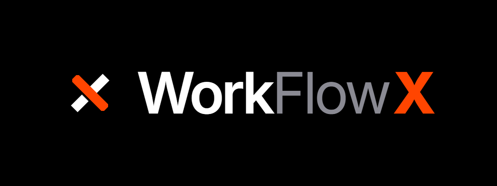
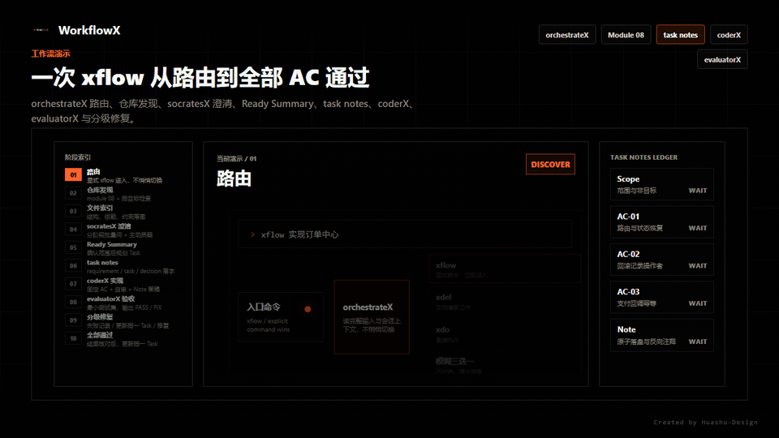
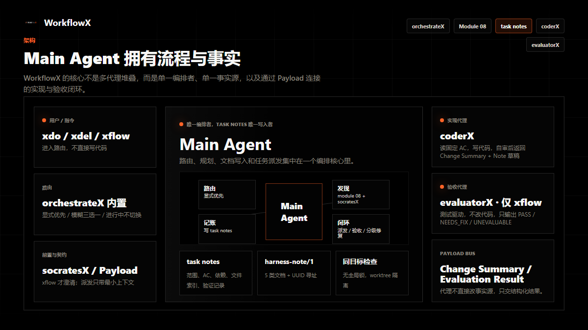
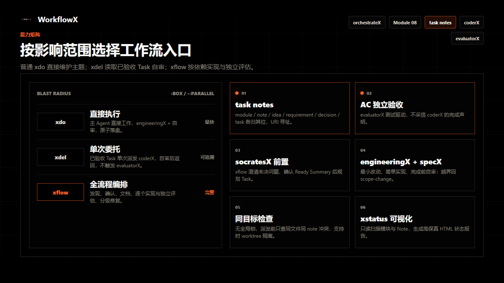
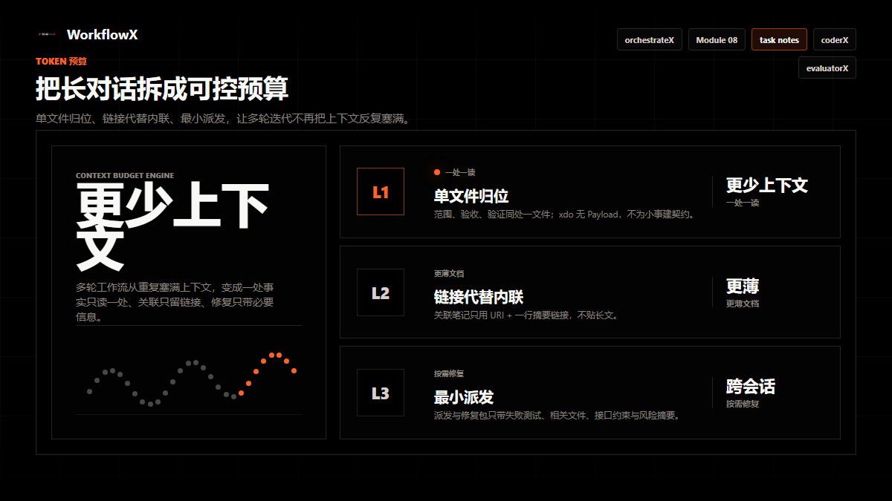

<div align="center">

**中文** · [English](./README.en.md)

# WorkflowX

### 让 AI 写代码像团队协作一样可控

<p align="center">
  
</p>

**一个纯文件驱动的多智能体协作框架 —— 把"和 AI 聊天写代码"升级为"有规划、有验收、可追踪"的工程流程**

[](./LICENSE)
[](#深入设计)
[](#深入设计)
[](#深入设计)


</div>

---

## 这是什么？

WorkflowX 是一套放进 AI 编程工具里的**工程化工作流**。你仍然只和一个主代理对话，但它不再“边聊边写”：

- **Main Agent 直接编排**：负责路由、需求发现、方案确认、task note 写入（`.agents/notes/`）、调度、文档更新和最终验证。
- **coderX 只负责实现**：读取派发 Task、固定验收引用和允许范围，遵循 `engineeringX + specX` 写代码，自审后返回 Change Summary 与 Note 草稿。
- **evaluatorX 独立验收（仅 xflow）**：测试驱动，只读不改，按固定 AC 建最小可执行测试集并运行，输出 `PASS / NEEDS_FIX / UNEVALUABLE`。
- **Task notes 记账**：`.agents/notes/` 按 `harness-note/1` 规范沉淀 `idea / initiative / requirement / decision / task`，范围、AC、文件索引、依赖、验证记录和唯一的 `execution` 状态各归其位。
- **Wiki 与蓝图共用 Note**：工程 wiki 直读原文，正式关系与正文引用分开，反链由索引派生；知识 wiki 记录实际读取的 Note 来源及哈希。双端 noteX 已接入[共同读取契约](.agents/notes/2026-09-24-note-index-derived-layer--c61d7a4e.md)，宿主读取和界面接入按[实施计划](.agents/notes/2026-09-24-note-corpus-index-blueprint-completion--f4b2c8d1.md)推进。

> 当前架构没有 `orchestratorX` 子代理，也没有独立 `routeX` skill：路由已合并进 `orchestrateX`，编排由 Main Agent 直接承担；`xdel / xflow` 只通过结构化 Payload 交接。旧 `.hybrid/` 文档与 MCP / `promptX` / `noiseX` 属于重构前历史，不再作为运行依据。

<p align="center">
  
  <br/>
  <sub>一次完整 xflow：仓库发现 → socratesX → Ready Summary → task notes → coderX → evaluatorX → 分级修复 → 原子收口</sub>
</p>

---

## 为什么需要它？

单个 AI 长对话写代码，真正的问题不是“模型不够聪明”，而是流程没有约束。WorkflowX 把常见失控点变成明确机制：

| 痛点 | WorkflowX 的处理方式 |
|---|---|
| **上下文越聊越乱** | Main Agent 维护状态，执行代理独立上下文工作，只通过 Payload 传递必要信息；后续 task 只传相关契约、文件、失败与风险，不回传完整历史 |
| **需求散落在聊天里** | 需求落到 5 类 task notes（一事一文件，URI 寻址），变更只改对应 note，受影响 task 按依赖重新调度 |
| **AI 自称完成但没达标** | evaluatorX 不信任 coderX 自述，独立建测试并运行，逐条核对固定 AC，输出测试结果与失败记录 |
| **编码后才发现需求误解** | xflow 先做仓库事实探索（module 08）、按阶段批量澄清的 socratesX 追问和主动质疑，经 Ready Summary 确认后才建 note |
| **多轮迭代 Token 成本高** | 单文件承载范围/验收/验证、关联笔记只用 URI + 一行摘要链接、派发与修复包只带最小上下文 |
| **并行任务相互覆盖** | 无全局锁，派发前只做同目标冲突检查；worktree 隔离（宿主支持时）+ task 责任边界 |

---

## 30 秒理解工作原理

```text
你
│
├─ xdo / xdel / xflow / xstatus
│
▼
Main Agent
├─ orchestrateX 路由：显式命令优先，否则按影响范围推荐；模糊时摆出三选一，进入模式后不再悄悄切换
├─ xdo：主 Agent 直接工作，engineeringX + 自审；原子落盘（代码 + Note + 入口反向注释，一次 commit）
├─ xdel：基于已验收 task note 单次委托 coderX（engineeringX + specX + 自审），带回 Note 草稿，不触发 evaluatorX
└─ xflow：仓库发现 → socratesX → Ready Summary → task notes → 按依赖派发与独立评估
        │
        ├─ coderX：单 task 实现并输出 Change Summary + Note 草稿
        └─ evaluatorX：按固定 AC 建最小测试集并运行，输出 Evaluation Result
```

<p align="center">
  
  <br/>
<sub>Main Agent 默认直接工作；复杂模式按需使用 coderX / evaluatorX（evaluatorX 仅 xflow）</sub>
</p>

一句话：**Main Agent 默认直接工作，engineeringX 提供实现原则与自审，复杂任务再使用 task notes、派发契约和测试驱动的评估链。原子落盘与 proseX 写作规范对三模式通用（门控时机为例外，标准本身无例外）。**

---

## 快速开始

**环境要求**：Node.js v18+

**1. 安装 WorkflowX**

| 平台 | 安装方式 |
|---|---|
| **Claude Code** | `/plugin marketplace add https://github.com/TreeX-X/workflowX` → `/plugin install workflowx` |
| **OpenAI Codex** | `/plugins` → 搜索 `workflowx` → Install Plugin |
| **手动部署** | 把 `.claude/` 或 `.codex/` 拷进项目根目录 |

**2. 跑第一条需求**

```bash
xdo 实现用户登录功能，支持邮箱密码和 OAuth
```

> Claude Code 可用斜杠命令；OpenAI Codex 使用自然语言前缀，例如直接以 `xdo` 开头。

---

## 三种模式

按改动影响范围选择。拿不准时直接描述需求，Main Agent 会结合状态推荐模式。

| 模式 | 适用场景 | 规划方式 | 验收循环 | 示例 |
|---|---|---|---|---|
| **`xdo`** | 主 Agent 直接工作 | engineeringX；task note 与 harness 可选；并行仅在用户明确要求时 | 主 Agent 自审与验证；原子落盘 | `xdo 给 Config 加超时配置` |
| **`xdel`** | 单 task 可追溯委托 | 使用已验收 task note（无则新建）；coderX 一次实现并自审，带回 Note 草稿 | 不触发 evaluatorX；独立复核只在明确要求时单开 | `xdel 修复订单列表分页 bug` |
| **`xflow`** | 新功能、跨模块重构、高影响任务 | 仓库发现 → socratesX → Ready Summary → task notes，按依赖执行 | 每个 task 后触发 evaluatorX；局部缺陷默认最多一次最小修复重派发 | `xflow 实现订单中心` |

常用参数：`-box demo` 在沙箱分支隔离执行；并行必须由用户明确要求，具体调度、共享文件协调与集成收口由 Main Agent 负责。已无 `-N` 轮数与 `-team` 参数，不存在固定迭代循环。

<p align="center">
  
</p>

---

## 一次 xflow 会发生什么？

以 `xflow 实现用户登录功能` 为例，流程是：

1. **入口路由**：Main Agent 按显式命令、完整输入和当前会话上下文路由；task notes（`.agents/notes/`）是持久的工作流事实来源，进入模式后不再悄悄切换。
2. **环境初始化**：轻量自检，无全局锁；遗留 `.hybrid/.workflow-lock` 存在则删除后继续；派发前只做同目标冲突检查，按需使用沙箱或明确请求的并行能力。
3. **仓库事实探索（module 08）**：搜索项目结构、相关模块、依赖、约束与既有约定，区分已证事实与未知项，形成文件索引，不做第二遍用户访谈。
4. **需求澄清（socratesX，仅 xflow）**：按目标范围、行为边界、实现方向、验证上线分阶段批量提问，只问能改变范围/架构/行为/AC/依赖/风险的问题；有真实取舍才给选项，否则直接问。
5. **Ready Summary 确认门**：信息充分时只提交一次 Ready Summary（目标、范围、非目标、约束、任务边界、影响文件、验证方式与风险），确认后才允许建 note；已确认事项不重复确认。
6. **生成 task notes**：Main Agent 写 `requirement / task / decision`（另有 `idea / initiative` 承载方向），包含范围、稳定 `AC-n`、依赖、文件索引与验证方向；派发依赖的事实必须先落字，口头约定不进派发。
7. **coderX 实现**：按 task 固定验收引用与允许范围写代码，遵循 `engineeringX + specX`，自审后输出 Change Summary 与 Note 草稿（新建 `implemented/` 或原位同步）。
8. **evaluatorX 验收**：按固定 AC 建最小可执行测试集并运行，输出 `PASS / NEEDS_FIX / UNEVALUABLE`、测试命令、失败用例、观察结果、可能原因、修复范围与回归风险；只读不改。
9. **收口**：Main Agent 分级修复（局部缺陷用 Repair Packet 同 task 最多自动重派发一次；跨 task 用 Integration Note 交给后续 task；架构/范围问题直修或改 note），`UNEVALUABLE` 缩小范围、补检查或显式记风险承接，预算耗尽则停下交还用户；代码 + Note + 入口反向注释一次 commit，写作遵循 `proseX`。

---

## 深入设计

<details>
<summary><b>Task notes：结构化任务资产</b></summary>

Task notes（`.agents/notes/`，规范见 `standards/harness-note/1/`）是 WorkflowX 的事实来源，一事一文件，以 frontmatter `id`（UUID）寻址为 `note://<repo-id>/<note-id>`：

| 文档 | 作用 |
|---|---|
| **idea** | 直觉、问题与 raw intent；方向先停车，不阻塞 Ready Summary |
| **initiative** | 跨仓产品方向，聚合有收益时才建 |
| **requirement** | 所需行为与稳定的 `AC-n` 验收条款（永不重编号） |
| **task** | 有界交付：范围、验收引用、验证记录、依赖与唯一的 `execution` 状态 |
| **decision** | 取舍：选项、成本与重访信号；`Alternatives` 必含什么都不做/复用项 |

Main Agent 拥有路由、调度、文档更新与最终验证。coderX 只读派发与验收引用并自审输出 Change Summary + Note 草稿；evaluatorX 只读并跑测试，不改代码与文档。无中央索引、无 Parent/Child 文件、无 plans 目录；关联笔记用 URI + 一行摘要链接，不内联长文。每个 `implemented/` 决策在核心入口留一条反向注释，代码 + Note + 注释同 commit 落盘，提交信息携带 Note 路径。旧 `.hybrid/` 与旧命名一律只读参考，不迁移。

</details>

<details>
<summary><b>AC 交叉验证：评估员不信任程序员（测试驱动）</b></summary>

evaluatorX 的验收目标不是“看 coderX 写了什么总结”，而是（`auditX`，仅 xflow，只读）：

1. 读取 task 的固定验收引用（固定版本）；
2. 为每条适用 AC 建可执行测试并运行最小有用集合；
3. 对结果标记 `PASS / NEEDS_FIX / UNEVALUABLE`；
4. 输出测试命令、失败用例、观察结果、可能原因、修复范围、回归风险与阻塞项；
5. 由 Main Agent 分级修复并更新文档。

这让“AI 说完成了”变成“独立质量门确认完成”。无可运行测试路径时报 `UNEVALUABLE`，绝不谎称通过。

</details>

<details>
<summary><b>Token 优化：多轮迭代省上下文</b></summary>

<p align="center">
  
</p>

| 层 | 策略 | 作用 |
|---|---|---|
| **L1 单文件归位** | 范围、验收、验证同处一文件；`xdo` 无 Payload，不为小事建契约 | 一处事实只读一处，不反复翻文档 |
| **L2 链接代替内联** | 关联笔记只用 URI + 一行摘要链接，不贴长文 | 文档更薄，跨会话可复用 |
| **L3 最小派发** | 派发与 Repair Packet 只带失败测试、相关文件、接口约束与风险摘要；后续 task 不回传完整历史 | 修复只带必要上下文，默认最多一次自动重派发 |
</details>

<details>
<summary><b>orchestrateX 路由与工作流上下文</b></summary>

路由已合并进 `orchestrateX`，无独立 skill。所有输入按完整提示词和当前会话上下文路由：

| 显式命令 | `xdo / xdel / xflow / xstatus` 优先 | 按指定模式立即进入 |
| 无显式命令 | 高影响、跨模块或不确定 | 推荐 `xflow`；本地清晰工作推荐 `xdel`，否则 `xdo` |
| 拿不准 | 模式模糊 | 摆出三选一，不悄悄代选 |
| 进行中 | 已有活跃工作流 | 后续输入留在当前模式，支持需求增量变更 |

默认即行动：“能不能 / 我想 / 帮我”类意图就是执行令，做完可评审结果再问；审批是最后一步，不为只读、可逆与已授权工作加前置确认。并行永远不隐式触发。

工作流连续性来自当前会话上下文和 task notes 文档。

</details>

<details>
<summary><b>其他内置能力</b></summary>

- **engineeringX**：最小改动、简单实现、完成前自审；未跑过的检查标未跑，不谎称通过。
- **specX**：coderX 专用契约阅读规则（`xdel / xflow` 才加载），越界回 scope-change request。
- **socratesX**：仅 `xflow` 前置澄清与 Ready Summary，用户不点名时 `xdo / xdel` 不调用。
- **noteX + proseX**：决策资产与写作标准；`xdo` 免门控时机，不免写作标准。
- **xstatus**：只读扫描 `.agents/notes/` 生成高保真 HTML 状态报告，忽略遗留格式。

```bash
xstatus
xstatus --output ./reports/today.html
```

</details>

---

## 平台支持

| 平台 | 配置目录 | 触发方式 | 并行模式 |
|---|---|---|---|
| **Claude Code** | `.claude/` | `/xflow` `/xdel` `/xdo` `/xstatus` | 并行仅在用户明确要求时；`Agent()` 原生派发，支持时用 worktree，否则记录后共享执行 |
| **OpenAI Codex** | `.codex/` | 自然语言前缀：`xflow` `xdel` `xdo` `xstatus` | `xdo` 默认主智能体直接执行；原生工具可用则直调，否则用 prompt-spawn 信封 + 回执，缺工具时报 degraded 不伪装执行 |

两套配置逻辑同源（路由、三模式、分级修复一致），仅 skill 路径、触发语法与派发适配器不同。核心 skill：`orchestrateX / socratesX / engineeringX / specX / auditX / noteX / proseX`；执行代理：`coderX / evaluatorX`；`orchestrateX` 模块：`01 / 02 / 05 / 07 / 08 / 09`。

---

## 框架对比

完整对比见 [comparison-report.md](docs/comparison-report.md)（历史快照，部分旧模式与评分不再反映现行 `xdo / xdel / xflow` 架构）。

| 能力 | WorkflowX | Superpowers | OMC |
|---|:---:|:---:|:---:|
| Task note 需求追踪（5 类 + harness 规范） | 独有 | 不支持 | 不支持 |
| 测试驱动的 AC 独立验收 | 独有 | 不支持 | 不支持 |
| 仓库发现 + socratesX + Ready Summary | 强 | 基础 | 基础 |
| 最小上下文派发与修复包 | 系统化 | 部分 | 部分 |
| 同目标冲突检查 + worktree 隔离 | 支持 | 部分 | 部分 |
| 状态报告可视化 | 内置 xstatus | 不同实现 | 不同实现 |

---

## 关于

WorkflowX 是一个真实投入社区使用的开源实验项目，目标是探索多智能体协同开发的可靠流程、文档结构和质量门。

欢迎讨论、建议与贡献。Fork 本仓库提交 Pull Request，或在 Issues 中分享你的使用场景与问题。

公众号：**TreeX-AI** · 如果对你有帮助，欢迎 Star。

**友情链接**：[Linux.Do](https://linux.do/) —— 为技术爱好者和专业人士提供高质量讨论与资源分享的社区。

---

<div align="center">

[MIT License](./LICENSE) · 自由使用 / 修改 / 再分发 · Made by [@TreeX-X](https://github.com/TreeX-X)

</div>

## 星级历史

<a href="https://www.star-history.com/#TreeX-X/workflowX&Date">
 <picture>
   <source media="(prefers-color-scheme: dark)" srcset="https://api.star-history.com/chart?repos=TreeX-X/workflowX&type=date&theme=dark&legend=top-left" />
   <source media="(prefers-color-scheme: light)" srcset="https://api.star-history.com/chart?repos=TreeX-X/workflowX&type=date&theme=dark&legend=top-left" />
   
 </picture>
</a>
